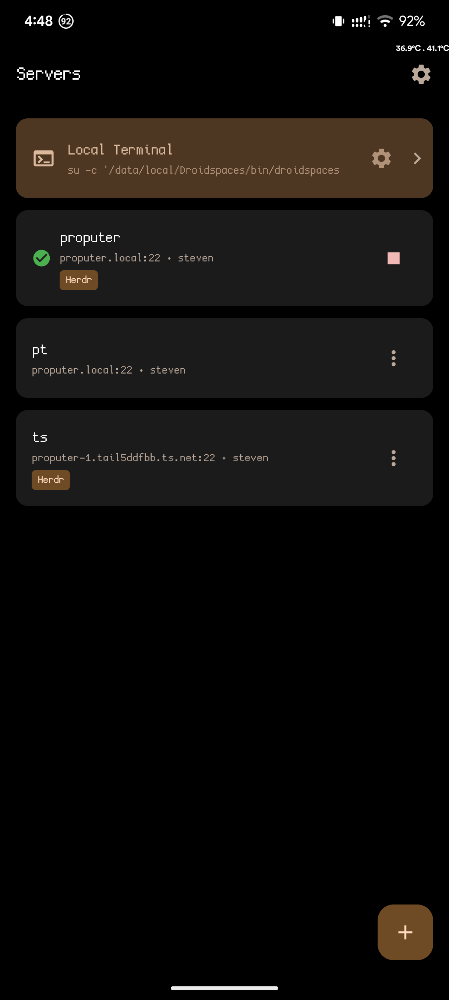
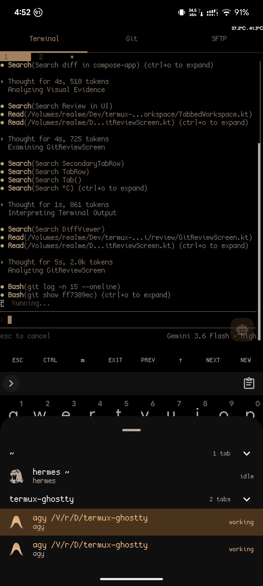
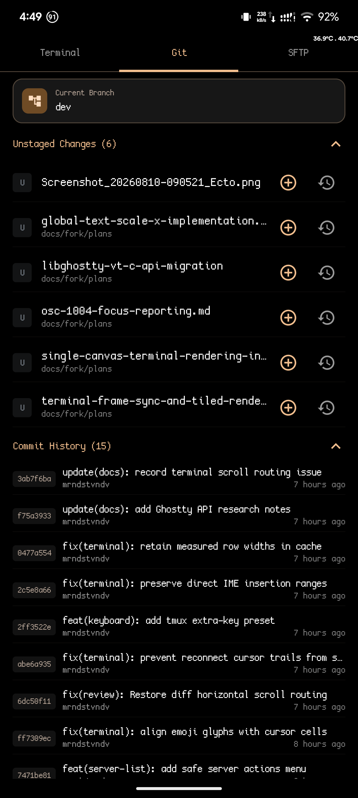
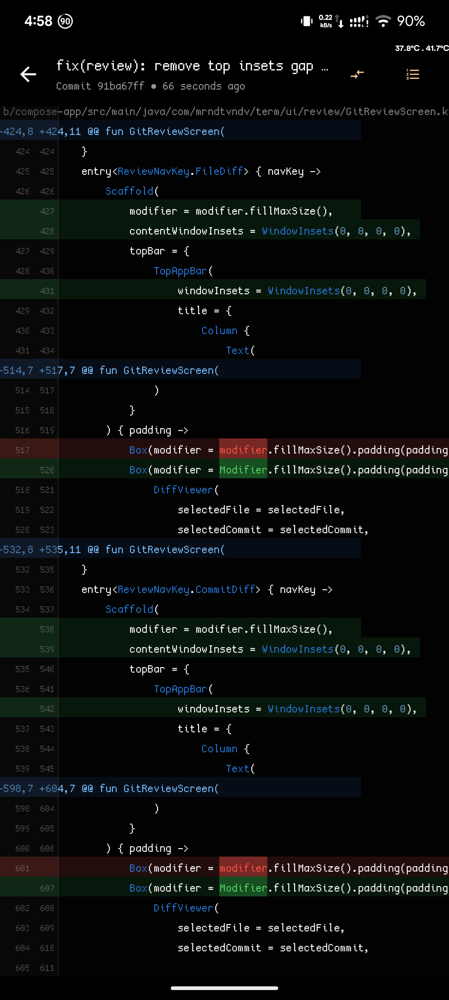
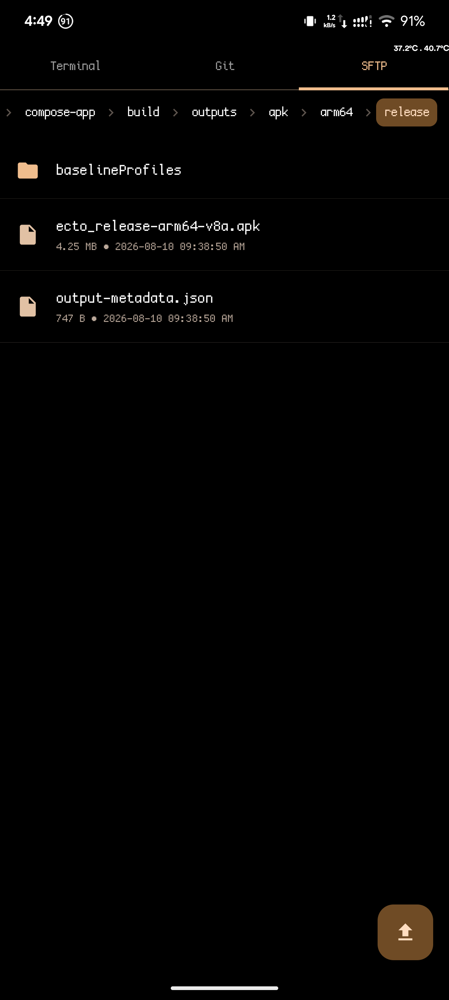
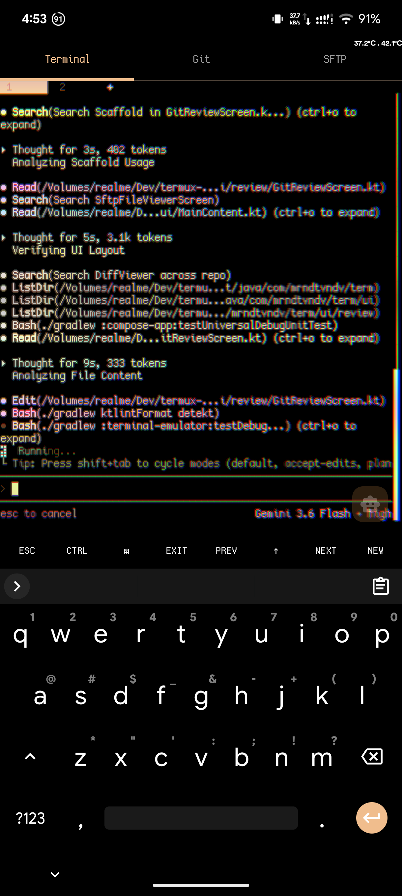

# Termux-Ghostty

An experimental Android terminal app using libghostty-vt as the terminal backend + added opinionated qol features.

> ⚠️ **NOTICE**: This is an **unofficial** fork and is **not affiliated with ghostty-org or termux**. It combines features from both projects under their respective licenses (GPLv3 and MIT).

> 🤖 **AI Assistance**: This project is developed with the assistance of AI coding tools. All code is reviewed and curated by a human maintainer.

## Features

- **Ghostty integration** — Uses Ghostty-backed VT parsing and terminal state management inside the app.
- **Android session bubbles** — Open terminal sessions as native Android 11+ bubbles without killing the underlying session when the bubble UI is dismissed.
- **Bubble unread dots for OSC notifications** — Bubbled sessions use conversation-style unread state instead of separate system notifications, and opening the session clears the unread indicator.
- **Session tabs** — Optional `termux.properties` support via `use-session-tabs=true` to show horizontal session tabs instead of the navigation drawer.
- **Tab bar position** — Vertical position of the session tab bar via `session-tab-bar-position=top|bottom` (defaults to `bottom`).
- **Tab bar alignment** — Alignment of the session tab bar via `session-tab-bar-align=left|center|right` (defaults to `left`).
- **Clickable terminal links** — Optional `termux.properties` support for tap-to-open links in Ghostty sessions via `terminal-onclick-url-open=true`, with `terminal-onclick-url-open-when-mouse-tracking-active=true` to prefer link taps over terminal mouse tracking.
- **Remember soft keyboard state** — Optional `termux.properties` support via `remember-soft-keyboard-state=true` to restore the last soft keyboard visibility state when reopening the app.
- **Material You theming** — Optional `termux.properties` support via `material-you-theme=disabled|light|dark|black|system` to theme the entire app (chrome + terminal ANSI palette) with wallpaper-derived Material 3 colors on Android 12+. `black` uses dynamic accent colors with pure black backgrounds. When enabled, `colors.properties` is ignored. Recreates automatically on wallpaper changes.

## Ecto (`compose-app`)

A vibe coding companion for Android — an SSH client with Herdr integration and a Ghostty terminal backend, built as a separate Jetpack Compose app (`com.mrndtvndv.term`).

### Screenshots

| Local & SSH | Herdr Workspaces | Git Review |
| :---: | :---: | :---: |
|  |  |  |
| **Diff Viewer** | **SFTP Browser** | **Cursor Effects** |
|  |  |  |

### Features

- **Ghostty terminal backend** — Native VT parsing and terminal state via `libghostty-vt`, rendered with hardware-accelerated OpenGL ES by default.
- **SSH client** — Native SSH sessions with a server manager (add/edit servers, one-tap connect).
- **Herdr integration** — Queries `herdr workspace list` / `herdr pane list` and tracks navigation state per workspace.
- **Git review tab** — Review, stage, and commit changes, edit commit messages, and reset to commits from the app.
- **SFTP tab** — Browse and transfer files on the connected server, synced to the active workspace's directory.
- **Cursor effects** — Warp, Sweep, and Tail cursor trails (adapted from ghostty-cursor-shaders).
- **Local terminal sessions** — Drop into a local shell when you don't need SSH.
- **Split & tabbed workspaces** — Multiple terminals per workspace.
- **Material You theming** — Dynamic wallpaper-derived colors.
- **Extra keys toolbar** — Configurable extra keys row above the soft keyboard.

## Status

Experimental and fast-moving.
