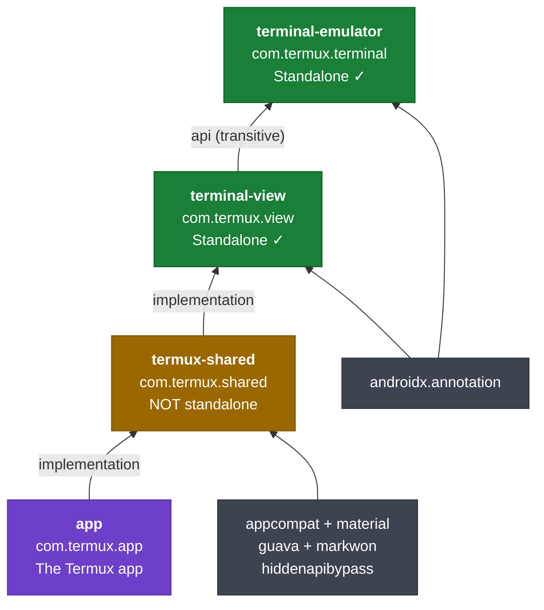
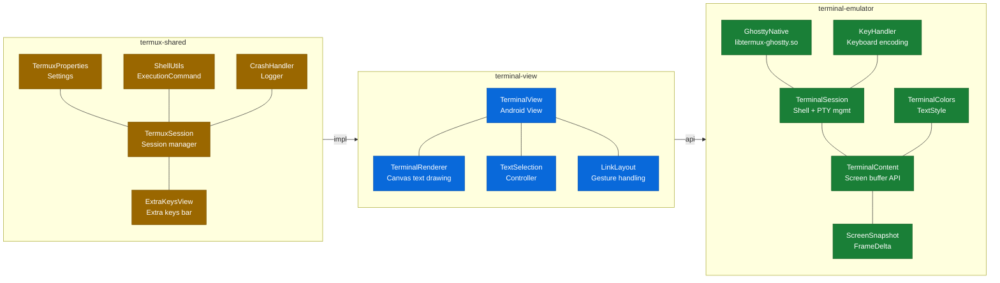
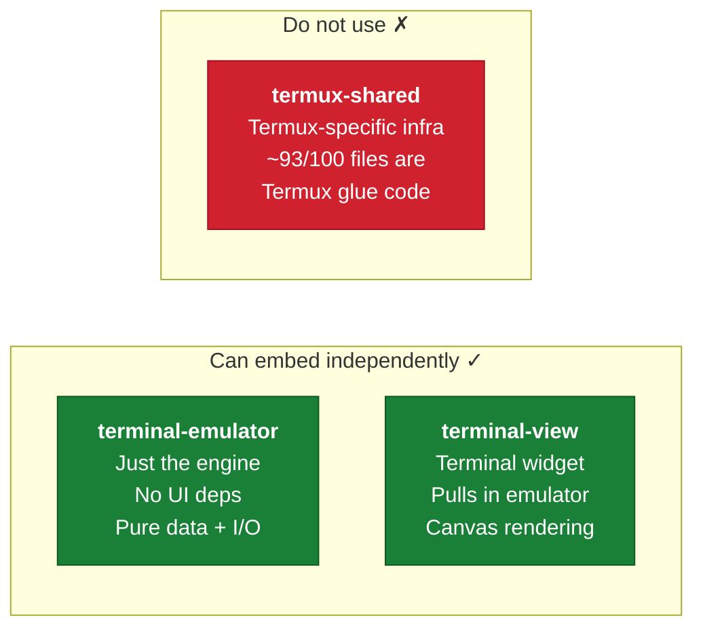

# Termux Module Architecture

## Dependency Graph



## What's Inside Each Module



## Third-Party Usability



---

## `terminal-emulator` — The Engine

**Package:** `com.termux.terminal`
**Coord:** `com.termux:terminal-emulator`
**Dependencies:** only `androidx.annotation`

### Contains
- VT100/xterm parsing (Ghostty native, `libtermux-ghostty.so`)
- `TerminalSession` — shell subprocess + PTY management
- `TerminalContent` — screen buffer abstraction
- `ScreenSnapshot`, `FrameDelta` — rendering data for consumers
- `KeyHandler` — keyboard encoding
- `TerminalColors`, `TextStyle` — color/style model
- `JNI` — native subprocess creation
- `GhosttySessionWorker` — async I/O thread for Ghostty
- `TerminalLinkSource` — URL/link detection

### Zero UI dependencies
No Canvas, Paint, Bitmap, View, or Android graphics imports.
Only `android.graphics.Color` for brightness calculation.

### Third-party usable?
**Yes.** Pure data + I/O. Any app can embed a terminal engine.

---

## `terminal-view` — The UI Layer

**Package:** `com.termux.view`
**Coord:** `com.termux:terminal-view`
**Dependencies:** `terminal-emulator` (transitive via `api`), `androidx.annotation`

### Contains
- `TerminalView` — Android View (~2000 lines)
- `TerminalRenderer` — Canvas-based text rendering
- Touch/mouse/keyboard/IME handling
- Text selection controller
- Cursor blinking (`TerminalCursorBlinkerRunnable`)
- Link detection layout (`TerminalViewLinkLayout`)
- Gesture and scale recognition
- AutoFill support

### Third-party usable?
**Yes.** Pulls in `terminal-emulator` transitively. This is the "give me a terminal widget" library.

```groovy
implementation 'com.termux:terminal-view:0.118.0'
// Includes terminal-emulator automatically
```

---

## `termux-shared` — Termux-Specific Infrastructure

**Package:** `com.termux.shared`
**Coord:** `com.termux:termux-shared`
**Dependencies:** `terminal-view` + appcompat, material, guava, markwon, hiddenapibypass

### Contains
- `TermuxConstants`, `TermuxBootstrap` — app paths, bootstrap config
- `TermuxSession` — higher-level session manager
- `ExtraKeysView`, `ExtraKeysInfo` — the extra keys bar
- `TermuxSharedProperties` — settings from `termux.properties`
- `ShellUtils`, `ExecutionCommand` — shell utilities
- `CrashHandler`, `Logger`, `NotificationUtils`
- App preferences for every Termux companion app (API, Boot, Float, Widget...)
- `TermuxTerminalSessionClientBase` — base impl of `TerminalSessionClient`
- `TermuxTerminalViewClientBase` — base impl of `TerminalViewClient`

### Coupling to terminal libraries
Only **7 of ~100 files** import `com.termux.terminal` or `com.termux.view`.
The rest is Termux-specific Android infrastructure.

### Third-party usable?
**No.** References Termux file paths, bootstrap types, companion app package names.
It's internal glue code for the Termux ecosystem.

---

## What a Third-Party App Needs

### Minimal: just the engine
```groovy
implementation 'com.termux:terminal-emulator:0.118.0'
```
Implement `TerminalSessionClient`. Manage the `TerminalView` yourself (or skip UI entirely for headless use).

### With UI: the terminal widget
```groovy
implementation 'com.termux:terminal-view:0.118.0'
```
Implement `TerminalSessionClient` + `TerminalViewClient`. Drop `TerminalView` into your layout.

### Don't use
```groovy
// This is Termux internals:
implementation 'com.termux:termux-shared:0.118.0'
```

---

## Key Interfaces for Consumers

### `TerminalSessionClient` (terminal-emulator)
Callbacks from session → app:
- `onTextChanged`, `onTitleChanged`, `onSessionFinished`
- `onCopyTextToClipboard`, `onPasteTextFromClipboard`
- `onBell`, `onColorsChanged`
- `setTerminalShellPid`
- Logging methods

### `TerminalViewClient` (terminal-view)
Callbacks from view → app:
- `onSingleTapUp`, `onLongPress`
- `onKeyDown`, `onKeyUp`, `onCodePoint`
- `onScale` (pinch zoom)
- `copyModeChanged`
- Key modifier reads (`readControlKey`, `readAltKey`, etc.)

### `TerminalContent` (terminal-emulator)
Screen state queries:
- `getColumns`, `getRows`, `getActiveRows`
- `getCursorRow`, `getCursorCol`, `getCursorStyle`
- `getSelectedText`, `getTranscriptText`
- `isAlternateBufferActive`, `isMouseTrackingActive`
- `fillSnapshot` (for rendering)
