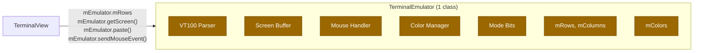
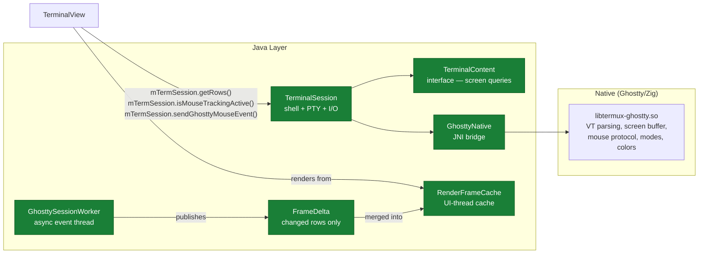
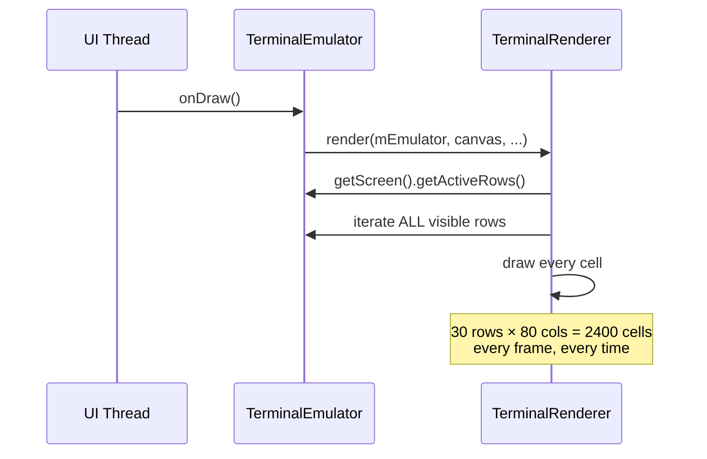
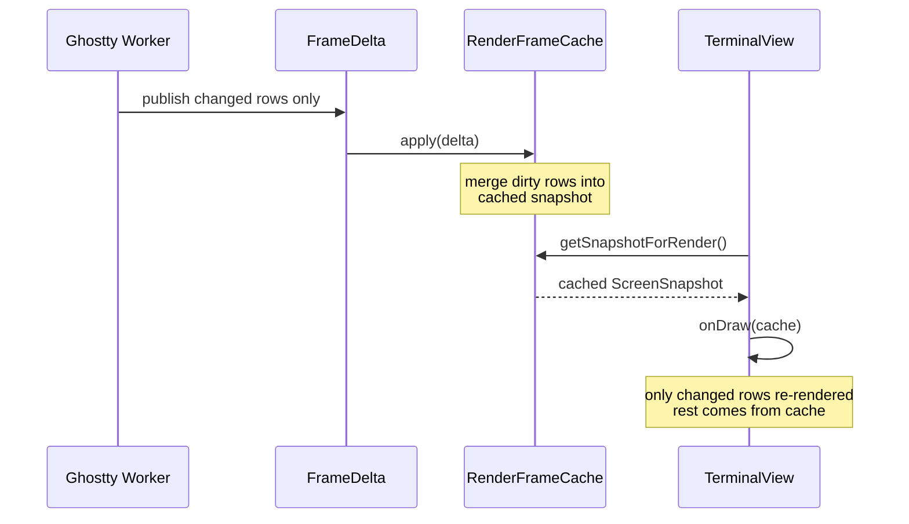
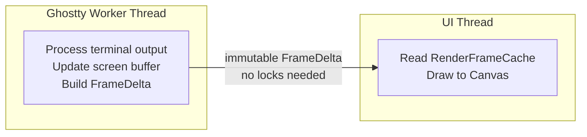

# How Terminal-View Adapts to the Ghostty Architecture

## The Old World (Upstream)

Upstream had one monolithic class: `TerminalEmulator` (~2600 lines).



`TerminalView` accessed everything through `mEmulator`:

```java
// All state reads go through the monolith
mEmulator.mRows
mEmulator.mColumns
mEmulator.isMouseTrackingActive()
mEmulator.getScreen().getActiveRows()
mEmulator.getScreen().getActiveTranscriptRows()

// All actions go through the monolith
mEmulator.paste(text)
mEmulator.sendMouseEvent(button, col, row, pressed)
mEmulator.setCursorBlinkState(true)
mEmulator.setCursorBlinkingEnabled(false)

// Rendering reads the whole emulator every frame
mRenderer.render(mEmulator, canvas, topRow, ...);
```

---

## The New World (Fork)

Ghostty replaced the Java VT parser. The emulation is now native.
Java is just the glue layer.



---

## Migration: What Changed in Terminal-View

### Direct field access → getter methods

| Upstream (field access) | Fork (method calls on session) |
|---|---|
| `mEmulator.mRows` | `mTermSession.getRows()` |
| `mEmulator.mColumns` | `mTermSession.getColumns()` |
| `mEmulator.getScreen().getActiveRows()` | `mTermSession.getActiveRows()` |
| `mEmulator.getScreen().getActiveTranscriptRows()` | `mTermSession.getActiveTranscriptRows()` |
| `mEmulator.getScreen().getSelectedText(...)` | `mTermSession.getTerminalContent().getSelectedText(...)` |

### Actions routed through session

| Upstream | Fork |
|---|---|
| `mEmulator.paste(text)` | `mTermSession.paste(text)` |
| `mEmulator.sendMouseEvent(btn, col, row, pressed)` | `mTermSession.sendGhosttyMouseEvent(GhosttyMouseEvent)` |
| `mEmulator.setCursorBlinkState(true)` | `mTermSession.setCursorBlinkState(true)` |
| `mEmulator.setCursorBlinkingEnabled(false)` | `mTermSession.setCursorBlinkingEnabled(false)` |
| `mEmulator.clearScrollCounter()` | `mTermSession.clearScrollCounter()` |
| `mEmulator.toggleAutoScrollDisabled()` | `mTermSession.toggleAutoScrollDisabled()` |

### New fork-only calls (no upstream equivalent)

These are Ghostty-specific features that didn't exist in upstream:

```java
// Frame delta rendering pipeline
FrameDelta delta = mTermSession.getGhosttyPublishedFrameDelta();
mGhosttyRenderFrameCache.apply(delta);
mGhosttyRenderFrameCache.getSnapshotForRender(cursorBlink, cursorState);

// Viewport scroll tracking
mTermSession.setGhosttyTopRow(mTopRow);

// Backend state
mTermSession.hasActiveTerminalBackend()
mTermSession.isGhosttyCursorBlinkingEnabled()
mTermSession.getGhosttyCursorBlinkState()

// Cell dimensions (was buried inside TerminalEmulator)
mTermSession.getCellWidthPixels()
mTermSession.getCellHeightPixels()
```

---

## The Rendering Pipeline

This is the biggest architectural difference.

### Upstream: Full scan every frame



### Fork: Incremental updates via frame deltas



### Why this matters

| Scenario | Upstream | Fork |
|---|---|---|
| Type one character | Re-render 30 rows × 80 cols | Update 1 row in cache |
| Scroll output | Re-render everything | Merge new rows, shift cache |
| No changes (idle) | Still re-renders full buffer | FrameDelta is null, skip |
| Cursor blink toggle | Re-render full buffer | Swap cursor flag in cache |

---

## Performance Benefits of Decoupling

Beyond the inherent gains of running VT parsing in native code,
the decoupled architecture itself enables:

### 1. Lock-free frame publishing



The old `TerminalEmulator` was one mutable object shared between threads.
The renderer had to either lock or copy the entire screen buffer every frame.
Now `FrameDelta` is an immutable message — the worker publishes it, the UI
consumes it. No synchronization overhead.

### 2. Skip unchanged frames

`RenderFrameCache.apply()` returns `IGNORED_OLDER_OR_DUPLICATE` for stale
frames. If the UI thread is behind (e.g. during fling animation), it
naturally skips intermediate frames instead of queuing render work.

### 3. Partial rebuilds

The `FrameDelta` carries `reasonFlags`:
- `REASON_APPEND` — new output, only bottom rows changed
- `REASON_VIEWPORT_SCROLL` — user scrolled, only viewport offset changed
- `REASON_RESIZE` — terminal resized, full rebuild needed
- `REASON_COLOR_SCHEME` — colors changed, no row data needed

The cache can optimize based on the reason — appending new output doesn't
need to re-check the top of the screen.

### 4. Decoupled read path

`TerminalContent` is a read-only interface. The renderer never mutates
terminal state. This means:
- Multiple consumers could read the same snapshot (e.g. renderer + a11y)
- The worker can continue processing I/O while the UI renders
- No "render lock" blocking terminal input

### 5. No emulator object allocation

Upstream: `new TerminalEmulator(...)` allocated the entire engine.
Fork: Ghostty allocates in native. Java just holds a pointer (`long`)
inside `GhosttyTerminalContent`. Less GC pressure.

---

## Summary

The migration from `mEmulator` to `mTermSession` looks like a simple
rename, but underneath it's an architectural shift:

- **One mutable class** → **read-only interfaces + immutable messages**
- **Full-scan rendering** → **incremental frame deltas**
- **Thread-shared state** → **lock-free message passing**
- **Java VT parser** → **native Ghostty engine**

Terminal-view adapted by talking to `TerminalSession` directly instead of
going through the `TerminalEmulator` intermediary. The session exposes both
the old-style queries (rows, columns, modes) and the new Ghostty-specific
features (frame deltas, cursor blink state, viewport tracking).
