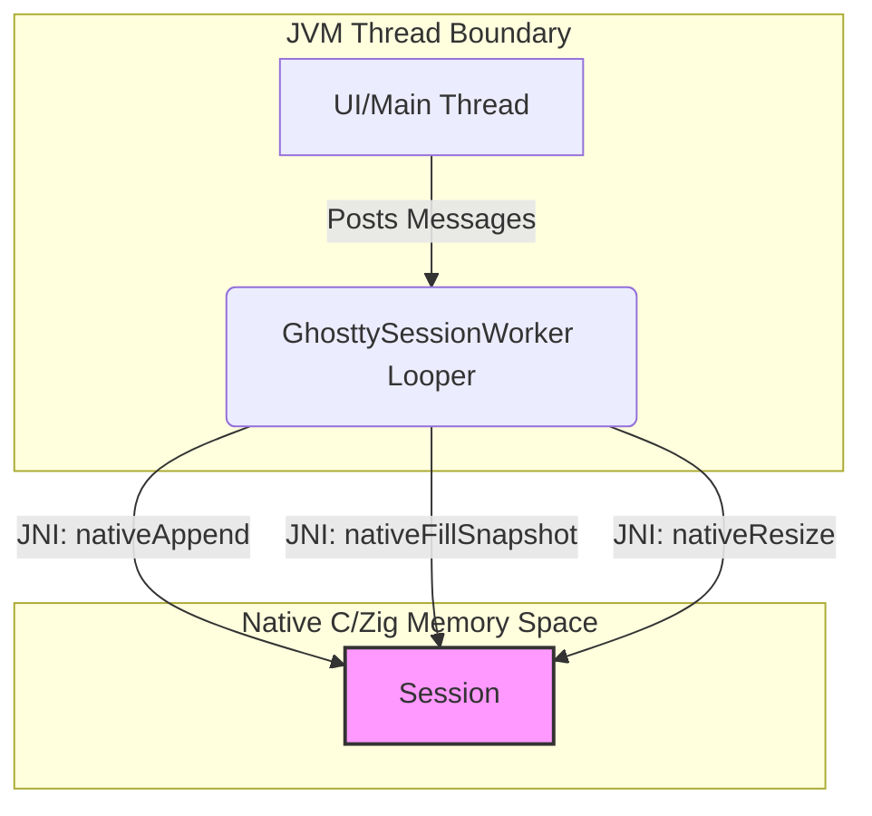
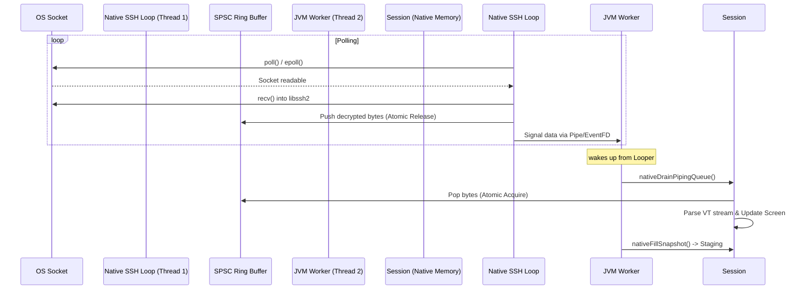

# Audit Report & Revised Action Plan: Phase 3 — Native Zig Piping Backend

This document contains a comprehensive technical audit of the Native Ghostty engine concurrency model, analyzes thread-safety hazards of integrating `libssh2`, evaluates synchronization strategies, and defines a production-grade revised action plan for **Phase 3 (Native Piping)**.

---

## 1. Concurrency Audit of the Native Ghostty Engine

### 1.1 Existing Threading Model
The native Ghostty wrapper (defined in [termux_ghostty.zig](file:///Volumes/realme/Dev/termux-ghostty/terminal-emulator/src/main/zig/src/termux_ghostty.zig)) compiles into a shared library where JNI exports are exposed in [jni_exports.zig](file:///Volumes/realme/Dev/termux-ghostty/terminal-emulator/src/main/zig/src/jni_exports.zig). 

Currently, thread safety is achieved through **single-thread confinement**:
* All mutations to the `Session` struct (including terminal initialization, resizes, data appending, viewport scrolling, color scheme updates, and snapshot serialization) are performed exclusively on the JVM **`GhosttySessionWorker`** thread.
* As seen in [jni_exports.zig](file:///Volumes/realme/Dev/termux-ghostty/terminal-emulator/src/main/zig/src/jni_exports.zig), functions like `termux_ghostty_session_append` and `termux_ghostty_session_fill_snapshot` **do not acquire locks**.
* Consequently, the native code is compiled without any internal mutexes, spinlocks, or memory fences protecting the `Session` struct or the underlying `ghostty-vt` terminal core.



### 1.2 Multi-Threaded Vulnerabilities
If a background native reader thread is introduced (e.g. to poll the SSH socket and read decrypted bytes via `libssh2`), and it calls `termux_ghostty_session_append` concurrently with JVM-driven operations, severe race conditions will arise:

1. **VT Parser vs. Snapshot Serialization (Data Corruption / Crash)**
   * **Writer Thread (Native Reader):** Modifies terminal state (`Session.terminal` and `Session.stream.nextSlice`) by parsing VT stream, updating screens, moving the cursor, and rolling history backlogs.
   * **Reader Thread (`GhosttySessionWorker`):** Concurrently serializes the screen via `termux_ghostty_session_fill_snapshot`, which invokes `updateRenderStateIfNeeded` and reads row details (cells, styles, codepoints).
   * **Impact:** Since `ArrayList` storage and cell structures are modified without barriers, the snapshot thread will encounter inconsistent states (e.g. partial writes, torn memory). In Zig, accessing collections during concurrent mutation causes undefined behavior, often manifesting as segmentation faults (due to page reallocations) or infinite loops.

2. **Resize vs. Parser Mutation (Memory Access Violation)**
   * `GhosttySessionWorker` handles terminal resizing (`nativeResize`), which deallocates/reallocates screens and changes column/row dimensions in `Session.terminal`.
   * Concurrently, the native reader thread could be parsing VT bytes, attempting to write characters to rows that are being reallocated.
   * **Impact:** Out-of-bounds writes, use-after-free, or immediate process crash.

3. **Scratch Buffer Contention**
   * The `Session` struct owns shared scratch arrays (e.g. `scratch_utf16`, `scratch_cell_starts`, `scratch_cell_lengths`). 
   * `writeSnapshotRow` (executed on `GhosttySessionWorker`) clears and grows these scratch buffers. If the reader thread runs concurrently and accesses any session methods that touch these scratch areas, the buffer memory will be corrupted.

---

## 2. Thread-Safety Audit of `libssh2`

`libssh2` is explicitly **not thread-safe**. 

### 2.1 Concurrency Constraints
* A single `LIBSSH2_SESSION` and its associated `LIBSSH2_CHANNEL` manage internal state machines (session packets, crypto key exchange, flow control windows, socket transport buffers).
* Concurrent invocations of `libssh2_channel_read` (on a background native thread) and `libssh2_channel_write` (on the JVM thread for keyboard input) will corrupt the internal session packets, leading to key exchange failures, disconnected sessions, or memory violations.

### 2.2 Memory Visibility and Barriers
In multi-threaded C/Zig code, updates to memory made by one CPU core are not guaranteed to be visible to other cores immediately unless a **Memory Barrier** (fence) is executed.
* Zig's standard variable assignments do not generate memory fences.
* Without synchronization, CPU cache lines containing socket buffers, terminal cells, or `libssh2` state will become desynchronized, causing subtle, hard-to-debug protocol and terminal emulation glitches.

---

## 3. Synchronization Strategy Audit

To bridge the native reader thread and the JVM worker thread safely, we evaluate three synchronization strategies:

### Option A: Session-Level Mutex (Blocking I/O)
Implement a native mutex (`std.Thread.Mutex` or `pthread_mutex_t`) in the `Session` struct. Every JNI function and native callback must acquire this lock before touching the `Session`.
* **Pros:** Straightforward. Ensures safety of the `Session` struct.
* **Cons (Critical Hazard):** If `libssh2_channel_read` is called in blocking mode, it blocks waiting for network socket data. If it holds the session lock while blocking, any JVM thread call (like `nativeResize` or `nativeFillSnapshot`) will block indefinitely. This will freeze the `GhosttySessionWorker` thread, causing major UI lag or **ANR (Application Not Responding)** crashes.

### Option B: Single-Threaded Event Loop (Non-blocking I/O + Mutex)
Set `libssh2` to non-blocking mode. Run a single native loop thread using `poll`/`epoll` to handle socket I/O.
* **Mechanism:**
  * The native loop thread is the **sole owner** of the `LIBSSH2_SESSION` and `LIBSSH2_CHANNEL`.
  * All reads (`libssh2_channel_read`) and writes (`libssh2_channel_write`) happen on this single thread. No locks are needed for `libssh2`.
  * **Session Mutex:** A lightweight mutex protects the `Session` struct. The native thread acquires it briefly only when appending parsed data (`termux_ghostty_session_append`). The JVM thread acquires it during resizes and snapshots.
* **Memory Visibility:** Mutex locking and unlocking act as full memory barriers, guaranteeing that memory writes to `Session` are fully visible between threads.
* **Evaluation:** High-performance, eliminates ANR risk (lock is only held for sub-millisecond, CPU-bound operations), but requires adding lock-unlock code to all JNI entry points.

### Option C: Native SPSC Lock-Free Queue (Confinement) — *RECOMMENDED*
Keep the `Session` struct confined **exclusively** to the JVM `GhosttySessionWorker` thread. Run a separate native reader thread for SSH socket polling.
* **Mechanism:**
  * **No Session Mutex Needed:** Since only the `GhosttySessionWorker` thread writes to and reads from `Session`, the terminal emulator remains single-threaded.
  * **Direct Native Piping:** The native thread polls the SSH socket, decrypts bytes using `libssh2`, and writes them into a native **Single-Producer Single-Consumer (SPSC) Ring Buffer**.
  * **Wake-up Signaling:** The native thread signals the JVM worker thread via a pipe descriptor or a JNI callback message.
  * **Consumption:** The `GhosttySessionWorker` thread wakes up and calls a new JNI function, `nativeDrainPipingQueue`, which pops bytes from the native ring buffer and appends them to the `Session` on the worker thread.
* **Memory Visibility:** The SPSC queue uses atomic operations with `Acquire`/`Release` ordering. Writing to the write-pointer releases the memory changes to the buffer, and reading the read-pointer acquires them, guaranteeing memory safety without lock overhead.
* **Evaluation:** Highly modular, zero lock contention, and completely eliminates the risk of thread safety regressions on `Session` methods.

---

## 4. Direct Native Piping (Zero JVM Crossing) Design

We adopt **Option C (Native SPSC Lock-Free Queue)** as it combines strict single-thread safety for `Session` with zero JVM object allocations for incoming SSH data.



### 4.1 How Bytes Flow
1. **OS Socket & Non-blocking `poll`:** The native thread runs a loop polling the socket file descriptor using `poll()` or `epoll()`. It also polls the read-end of a native control pipe (used to trigger writes or shutdowns).
2. **`libssh2` Decryption:** When the socket is readable, the native loop calls `libssh2_channel_read`. This reads packets from the socket and decrypts them in native space.
3. **Queue Ingest:** Decrypted bytes are pushed directly into a native SPSC Ring Buffer. **No JVM objects are created.**
4. **JVM Worker Wake-up:** After pushing data, the native thread writes a single byte to a wake-up pipe. The read-end of this pipe is monitored by the JVM `GhosttySessionWorker` Looper or a background selector.
5. **Session Update:** The JVM worker thread wakes up, processes the event, and invokes:
   ```zig
   pub export fn Java_com_termux_terminal_GhosttyNative_nativeDrainPipingQueue(
       env: ?*c.JNIEnv,
       clazz: c.jclass,
       session_handle: jlong,
       queue_handle: jlong,
   ) jint
   ```
   This function pops bytes directly from the ring buffer and calls `termux_ghostty_session_append` inside native memory. The bytes never cross to the JVM heap.

---

### 4.2 Zig Implementation Details (SPSC Ring Buffer)

Below is the production-grade SPSC Queue structure in Zig:

```zig
const std = @import("std");
const Atomic = std.atomic.Value;

pub const SpscRingBuffer = struct {
    buffer: []u8,
    write_ptr: Atomic(usize),
    read_ptr: Atomic(usize),
    capacity: usize,
    allocator: std.mem.Allocator,

    pub fn init(allocator: std.mem.Allocator, capacity: usize) !*SpscRingBuffer {
        // Ensure capacity is a power of 2 for fast masking
        const actual_capacity = std.math.ceilPowerOfTwo(usize, capacity) catch capacity;
        const buf = try allocator.alloc(u8, actual_capacity);
        
        const self = try allocator.create(SpscRingBuffer);
        self.* = .{
            .buffer = buf,
            .write_ptr = Atomic(usize).init(0),
            .read_ptr = Atomic(usize).init(0),
            .capacity = actual_capacity,
            .allocator = allocator,
        };
        return self;
    }

    pub fn deinit(self: *SpscRingBuffer) void {
        self.allocator.free(self.buffer);
        self.allocator.destroy(self);
    }

    /// Called by the Native SSH Thread (Producer)
    pub fn write(self: *SpscRingBuffer, data: []const u8) usize {
        const write_idx = self.write_ptr.load(.monotonic);
        const read_idx = self.read_ptr.load(.acquire); // Acquire reader progress
        
        const mask = self.capacity - 1;
        const available = self.capacity - (write_idx -% read_idx);
        const to_write = @min(data.len, available);
        if (to_write == 0) return 0;

        var i: usize = 0;
        while (i < to_write) : (i += 1) {
            self.buffer[(write_idx +% i) & mask] = data[i];
        }

        // Release the written bytes to the consumer thread
        self.write_ptr.store(write_idx +% to_write, .release);
        return to_write;
    }

    /// Called by the JVM Session Worker Thread (Consumer)
    pub fn readDirectToSession(self: *SpscRingBuffer, session: *anyopaque, append_fn: fn (*anyopaque, [*]const u8, usize) u32) usize {
        const read_idx = self.read_ptr.load(.monotonic);
        const write_idx = self.write_ptr.load(.acquire); // Acquire writer progress
        
        const mask = self.capacity - 1;
        const count = write_idx -% read_idx;
        if (count == 0) return 0;

        // Read in up to two contiguous chunks (handling wrap-around)
        const start_offset = read_idx & mask;
        const chunk1_len = @min(count, self.capacity - start_offset);
        
        _ = append_fn(session, self.buffer[start_offset..].ptr, chunk1_len);
        
        if (chunk1_len < count) {
            const chunk2_len = count - chunk1_len;
            _ = append_fn(session, self.buffer[0..].ptr, chunk2_len);
        }

        // Update read pointer so producer knows space is free
        self.read_ptr.store(read_idx +% count, .release);
        return count;
    }
};
```

---

### 4.3 SSH Thread Control Loop (Write Path Integration)

To handle writes (sending user keys over SSH), the native loop monitors a control queue. Keystrokes are pushed to a native lock-protected write queue and a byte is written to the wake-up pipe to trigger transmission:

```zig
pub const SshNativeQueue = struct {
    session: *c.LIBSSH2_SESSION,
    channel: *c.LIBSSH2_CHANNEL,
    socket_fd: c_int,
    wake_pipe: [2]c_int, // pipe[0] = read, pipe[1] = write
    spsc_buffer: *SpscRingBuffer,
    write_lock: std.Thread.Mutex,
    write_queue: std.ArrayList(u8),
    running: std.atomic.Value(bool),

    pub fn loop(self: *SshNativeQueue) void {
        var fds = [_]std.posix.pollfd{
            .{ .fd = self.socket_fd, .events = std.posix.POLL.IN, .revents = 0 },
            .{ .fd = self.wake_pipe[0], .events = std.posix.POLL.IN, .revents = 0 },
        };

        while (self.running.load(.acquire)) {
            // Block until socket or control pipe is ready
            const poll_res = std.posix.poll(&fds, -1) catch |err| {
                std.log.err("Poll failed: {}", .{err});
                break;
            };
            if (poll_res <= 0) continue;

            // 1. Process Socket Read
            if ((fds[0].revents & std.posix.POLL.IN) != 0) {
                var temp_buf: [16384]u8 = undefined;
                // libssh2 in non-blocking mode will read what is available
                const read_bytes = c.libssh2_channel_read(self.channel, &temp_buf, temp_buf.len);
                if (read_bytes > 0) {
                    const written = self.spsc_buffer.write(temp_buf[0..@intCast(read_bytes)]);
                    if (written > 0) {
                        // Signal JVM that data is ready to drain
                        self.signalJvmWorker();
                    }
                } else if (read_bytes == c.LIBSSH2_ERROR_EAGAIN) {
                    // No data available right now, retry on next poll
                } else {
                    // Connection closed or error
                    self.running.store(false, .release);
                }
            }

            // 2. Process Control Pipe (Keystroke Writes or Shutdowns)
            if ((fds[1].revents & std.posix.POLL.IN) != 0) {
                var clean_buf: [128]u8 = undefined;
                _ = std.posix.read(self.wake_pipe[0], &clean_buf) catch 0;
                
                self.processWriteQueue();
            }
        }
    }

    fn processWriteQueue(self: *SshNativeQueue) void {
        self.write_lock.lock();
        if (self.write_queue.items.len == 0) {
            self.write_lock.unlock();
            return;
        }
        
        // Copy out buffer to minimize lock holding time
        const copy = std.heap.c_allocator.dupe(u8, self.write_queue.items) catch {
            self.write_lock.unlock();
            return;
        };
        self.write_queue.clearRetainingCapacity();
        self.write_lock.unlock();
        defer std.heap.c_allocator.free(copy);

        var written: usize = 0;
        while (written < copy.len) {
            const res = c.libssh2_channel_write(self.channel, copy[written..].ptr, copy.len - written);
            if (res > 0) {
                written += @intCast(res);
            } else if (res == c.LIBSSH2_ERROR_EAGAIN) {
                // If we get blocked on SSH buffer window, wait and retry
                std.time.sleep(1_000_000);
            } else {
                break; // Error
            }
        }
    }

    fn signalJvmWorker(self: *SshNativeQueue) void {
        // Implementation writes to a dedicated pipe fd registered with the JVM worker's Looper
        // or uses a JNI callback to post a message.
    }
};
```

---

## 5. Revised Action Plan: Phase 3 Implementation

### Step 1: Android NDK Integration & Cross-Compilation
* [ ] Configure static cross-compilation of `mbedtls` (`libmbedcrypto.a`, `libmbedx509.a`, `libmbedtls.a`) and `libssh2.a` for all four target architectures (`arm64-v8a`, `armeabi-v7a`, `x86_64`, `x86`).
* [ ] Add dynamic linking exports inside `build.zig` to statically bind the `.a` files into `libghostty_ssh.so`.
* [ ] Verify ABI builds compile cleanly and symbols are properly stripped except for designated JNI APIs.

### Step 2: Native SPSC Ring Buffer & Thread Loop
* [ ] Implement `SpscRingBuffer` in `terminal-emulator/src/main/zig/src/spsc_ring_buffer.zig` with atomic acquires and releases.
* [ ] Write the non-blocking polling thread loop using Zig standard OS poll bindings (`std.posix.poll`).
* [ ] Implement thread-safe control flow for SSH connection teardown, cleaning up variables, and calling `DetachCurrentThread` on the background thread.

### Step 3: JVM Piping Integration
* [ ] Update `GhosttySessionWorker.java` to support native piping mode. Add a JNI wake-up pipe listener using Android's `MessageQueue.addOnFileDescriptorEventListener`.
* [ ] Implement `nativeDrainPipingQueue(sessionPtr, queuePtr)` in [jni_exports.zig](file:///Volumes/realme/Dev/termux-ghostty/terminal-emulator/src/main/zig/src/jni_exports.zig). This method will drain the ring buffer and call `termux_ghostty_session_append` inside native memory.
* [ ] Bind keystroke outputs from `TerminalSession.write` to push bytes into the native write queue and write to the native wake-up pipe.

### Step 4: Verification & Concurrency Stress Testing
* [ ] Run stress tests simulating high-throughput text streams (e.g. `cat /dev/urandom` over SSH) alongside rapid UI resizes and scrolling events.
* [ ] Audit for memory leaks (no JNI Global Reference leaks) and race conditions using thread diagnostics.
* [ ] Confirm input response times are minimal, matching or exceeding the standard Termux PTY performance.

---
*Related Plans:*
* [Master Plan](file:///Volumes/realme/Dev/termux-ghostty/plans/compose-app/master_plan.md)
* [Phase 1: JVM-Based Prototype](file:///Volumes/realme/Dev/termux-ghostty/plans/compose-app/phase_1_jvm_prototype.md)
* [Phase 2: Compose UI & UX Design](file:///Volumes/realme/Dev/termux-ghostty/plans/compose-app/phase_2_compose_ui.md)
