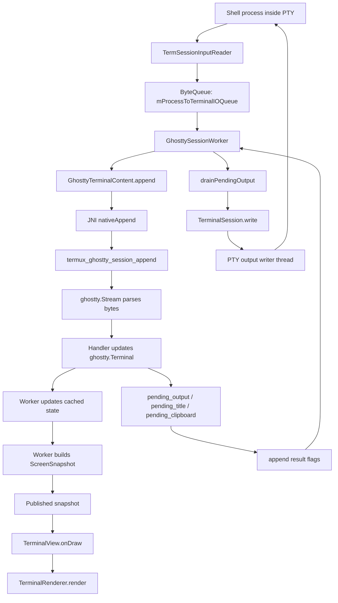
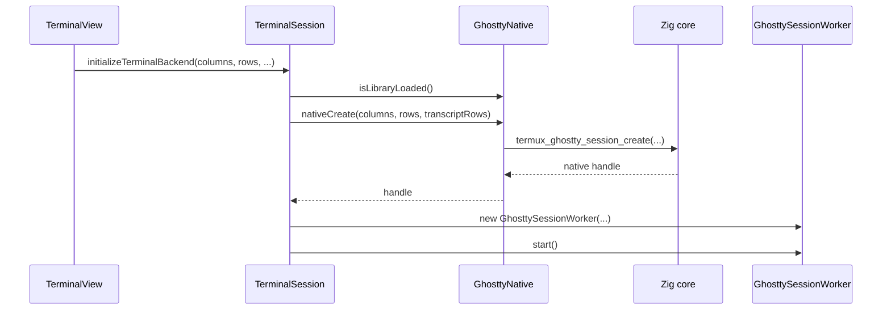
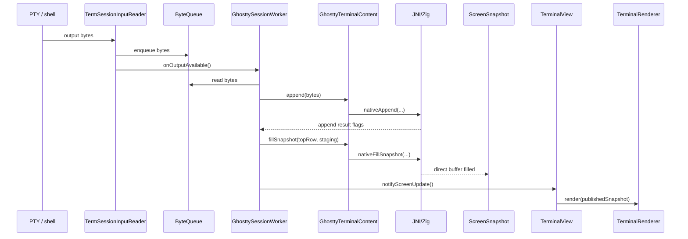
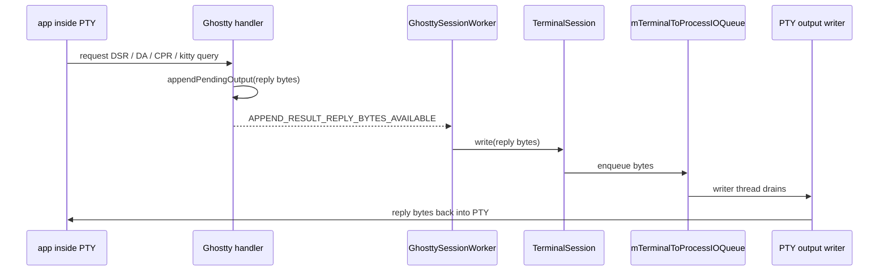

# Ghostty Backend Walkthrough

This document explains how the Ghostty backend in this repo works, file by file, and how data moves through the system.

Scope:
- what each Ghostty-related file does
- how the native Zig core plugs into the Java/Android app
- how rendering works
- how PTY input/output flows
- sample code snippets from the integration

---

# 1. High-level architecture map

At a high level, the Ghostty backend is:

- **Ghostty VT/parser/terminal state** in native Zig
- exposed to Android through **JNI**
- owned at runtime by a dedicated **Java worker thread**
- rendered by the existing **Termux Java renderer/view**

Ghostty does **terminal emulation**, not Android drawing.

## Layer map

```text
+--------------------------------------------------------------+
| Android UI                                                   |
|  TerminalView -> TerminalRenderer -> Canvas                  |
+------------------------------^-------------------------------+
                               |
                               | ScreenSnapshot
                               |
+--------------------------------------------------------------+
| Java session layer                                            |
|  TerminalSession                                              |
|  GhosttySessionWorker                                         |
|  GhosttyTerminalContent                                       |
|  GhosttyNative (JNI declarations)                             |
+------------------------------^-------------------------------+
                               |
                               | JNI calls / native handle
                               |
+--------------------------------------------------------------+
| Zig native layer                                              |
|  jni_exports.zig                                              |
|  termux_ghostty.zig                                           |
|    Session                                                    |
|    ghostty.Terminal                                           |
|    ghostty.Stream                                             |
|    Handler adapter                                            |
+------------------------------^-------------------------------+
                               |
                               | vendored dependency
                               |
+--------------------------------------------------------------+
| Ghostty upstream terminal core                                |
|  ghostty-vt                                                   |
+--------------------------------------------------------------+
```

## Runtime data flow



## Ownership map

Important ownership rule:

- **`GhosttySessionWorker` is the sole owner of the native Ghostty session during normal runtime.**
- UI code does not mutate native terminal state directly.
- UI mostly reads already-built snapshots and cached metadata.

That is the main concurrency boundary.

---

# 2. File-by-file walkthrough

## 2.1 `terminal-emulator/src/main/zig/build.zig`

Purpose:
- builds the native shared library: `libtermux-ghostty.so`
- wires the Ghostty dependency into the Zig build
- adds Android NDK include/library paths when targeting Android

What it does:
- defines a build option `ghostty-log`
- creates the root module from `src/jni_exports.zig`
- imports `ghostty-vt` from the lazy dependency
- builds a dynamic library named `termux-ghostty`
- links Android system log library when on Android

Representative snippet:

```zig
const lib = b.addLibrary(.{
    .name = "termux-ghostty",
    .linkage = .dynamic,
    .root_module = root_module,
    .version = .{ .major = 0, .minor = 0, .patch = 0 },
});
```

Why it matters:
- this is the bridge from the Android app to the Ghostty core
- without this library, the backend falls back to the Java terminal emulator

---

## 2.2 `terminal-emulator/src/main/zig/build.zig.zon`

Purpose:
- pins the upstream Ghostty dependency version/hash

Representative snippet:

```zig
.dependencies = .{
    .ghostty = .{
        .url = "https://github.com/ghostty-org/ghostty/archive/0f2eaed68cd2feb5a48e733fe7b39a73d341e5f2.tar.gz",
        .hash = "ghostty-1.3.2-dev-5UdBCzzP-wRHgGI_exHqsmsIUDktrszn6lzdPmEmDTnX",
    },
},
```

Why it matters:
- tells you this backend is embedding Ghostty’s terminal implementation, not reimplementing it from scratch

---

## 2.3 `terminal-emulator/src/main/zig/include/termux_ghostty.h`

Purpose:
- C-facing header for the native session API
- documents the exported native surface in a compact way

Main exported functions:
- create / destroy / reset / resize
- append PTY bytes
- drain pending output
- fill a screen snapshot
- query rows / columns / mode bits / cursor state

Representative snippet:

```c
termux_ghostty_session* termux_ghostty_session_create(int32_t columns, int32_t rows, int32_t transcript_rows);
uint32_t termux_ghostty_session_append(termux_ghostty_session* session, const uint8_t* data, size_t len);
int32_t termux_ghostty_session_fill_snapshot(termux_ghostty_session* session, int32_t top_row, uint8_t* buffer, size_t capacity);
```

Why it matters:
- this is the cleanest summary of the native API shape

---

## 2.4 `terminal-emulator/src/main/zig/src/jni_exports.zig`

Purpose:
- JNI glue between Java and the native Ghostty session API

This file does not implement terminal logic. It translates Java calls into `termux_ghostty.zig` calls.

Main responsibilities:
- turn `jlong` into native session pointers
- copy Java byte arrays into temporary Zig buffers
- pass direct `ByteBuffer` addresses into native snapshot fill
- convert native C strings into Java `String`

### Important JNI entry points

#### `nativeCreate`
Creates a native session and returns the pointer as a `long` handle.

```zig
const session = core.termux_ghostty_session_create(columns, rows, transcript_rows) orelse {
    return 0;
};
const handle: jlong = @intCast(@intFromPtr(session));
return handle;
```

#### `nativeAppend`
Copies bytes from a Java `byte[]`, then feeds them into the native terminal.

```zig
jni.*.*.GetByteArrayRegion.?(jni, data, offset, length, @ptrCast(bytes.ptr));
return @intCast(core.termux_ghostty_session_append(handle, bytes.ptr, bytes.len));
```

#### `nativeFillSnapshot`
Gets the address of a direct `ByteBuffer` and asks native code to serialize the current viewport.

```zig
const address = jni.*.*.GetDirectBufferAddress.?(jni, buffer) orelse return -1;
const result = core.termux_ghostty_session_fill_snapshot(handle, top_row, @ptrCast(address), count);
return result;
```

Why it matters:
- all Java/native communication goes through this layer
- this layer is intentionally thin so terminal logic stays in one place: `termux_ghostty.zig`

---

## 2.5 `terminal-emulator/src/main/zig/src/termux_ghostty.zig`

Purpose:
- this is the core native implementation
- owns the Ghostty terminal session
- parses PTY output
- stores side effects
- builds render snapshots

This is the most important file.

## Main concepts inside this file

### `Session`
A native session contains:
- allocator
- `ghostty.Terminal`
- `ghostty.Stream(*Handler)`
- `ghostty.RenderState`
- output buffers for replies/title/clipboard
- scratch arrays for snapshot generation
- booleans like `colors_changed` and `bell_pending`

Representative structure:

```zig
pub const Session = struct {
    alloc: std.mem.Allocator,
    terminal: ghostty.Terminal,
    handler: Handler,
    stream: ghostty.Stream(*Handler),
    render_state: ghostty.RenderState = .empty,
    pending_output: std.ArrayListUnmanaged(u8) = .empty,
    pending_title: std.ArrayListUnmanaged(u8) = .empty,
    pending_clipboard: std.ArrayListUnmanaged(u8) = .empty,
    // ... scratch buffers omitted
};
```

### `Handler`
`Handler` is the adapter between parsed Ghostty stream actions and the terminal model.

Ghostty parses bytes into actions like:
- print
- cursor movement
- erase display
- set mode
- device status request
- OSC title
- clipboard contents
- color operation

Then `Handler.vtFallible()` applies those actions.

Representative snippet:

```zig
switch (action) {
    .print => try self.session.terminal.print(value.cp),
    .bell => self.session.bell_pending = true,
    .cursor_up => self.session.terminal.cursorUp(value.value),
    .erase_display_complete => self.session.terminal.eraseDisplay(.complete, value),
    .window_title => try self.session.replacePendingTitle(value.title),
    .clipboard_contents => try self.clipboardContents(value.kind, value.data),
    .device_status => try self.deviceStatus(value.request),
    .color_operation => try self.colorOperation(value.op, &value.requests, value.terminator),
    // ... many more
}
```

That adapter is where most protocol behavior lives.

## Important native exports

### `termux_ghostty_session_create`
Validates dimensions, estimates scrollback bytes, initializes `ghostty.Terminal`, creates the parser stream.

```zig
session.terminal = ghostty.Terminal.init(session.alloc, .{
    .cols = parsed_columns,
    .rows = parsed_rows,
    .max_scrollback = scrollback_bytes,
    .colors = colors,
}) catch |err| {
    return null;
};
```

The scrollback budget is estimated from columns and transcript rows:

```zig
fn estimatedScrollbackBytes(columns: u16, transcript_rows: usize) usize {
    const row_bytes = (@sizeOf(ghostty.Cell) * @as(usize, columns)) + @sizeOf(ghostty.page.Row) + 64;
    return std.math.mul(usize, row_bytes, transcript_rows) catch std.math.maxInt(usize);
}
```

### `termux_ghostty_session_append`
Hot path for PTY output.

What it does:
1. snapshot old cursor/mode/transcript state
2. feed bytes into `handle.stream.nextSlice(...)`
3. let the `Handler` mutate terminal state
4. compute result flags

Representative snippet:

```zig
handle.stream.nextSlice(bytes[0..len]);

var result: u32 = append_result_screen_changed;
if (old_cursor_row != handle.cursorRow() or old_cursor_col != handle.cursorCol()) {
    result |= append_result_cursor_changed;
}
if (handle.pending_title.items.len > 0) {
    result |= append_result_title_changed;
}
if (handle.pending_output.items.len > 0) {
    result |= append_result_reply_bytes_available;
}
```

This is the main event boundary between native and Java.

### `termux_ghostty_session_fill_snapshot`
Serializes the current viewport into a direct byte buffer.

Steps:
1. sync Ghostty viewport from Termux `topRow`
2. update `render_state`
3. compute required bytes
4. write header + palette + row/cell payload

Representative snippet:

```zig
handle.ensureRenderState(top_row) catch return -1;
const required_bytes = handle.snapshotRequiredBytes() catch return -1;
if (capacity < required_bytes) {
    return required_i32;
}

writer.writeU32(snapshot_magic) catch return -1;
writer.writeU32(handle.render_state.rows) catch return -1;
writer.writeU32(handle.render_state.cols) catch return -1;
writeSnapshotPalette(&writer, handle) catch return -1;
```

Each cell stores:
- UTF-16 start offset
- UTF-16 length
- display width
- encoded style bits/colors

### viewport mapping helpers
Termux scrollback uses external row numbers where `0` is the live bottom and negatives are scrollback.
Ghostty uses its own internal row/page model.

These helpers translate between them:
- `clampExternalTopRow`
- `absoluteScreenRowForExternal`
- `syncViewportToExternalTopRow`

Representative snippet:

```zig
fn syncViewportToExternalTopRow(self: *Session, top_row: i32) void {
    const clamped_top_row = self.clampExternalTopRow(top_row);
    const absolute_row = self.absoluteScreenRowForExternal(clamped_top_row);
    self.terminal.scrollViewport(.{ .delta = 0 });
    self.terminal.screens.active.scroll(.{ .row = absolute_row });
}
```

### reply generation
Some escape sequences require terminal-generated replies.
Examples:
- device attributes
- device status report
- size reports
- mode reports
- kitty keyboard query

Instead of writing to PTY directly, native code appends reply bytes to `pending_output`.

Representative snippets:

```zig
fn deviceStatus(self: *Handler, req: ghostty.device_status.Request) !void {
    switch (req) {
        .operating_status => try self.session.appendPendingOutput("\x1B[0n"),
        .cursor_position => {
            const row = self.session.terminal.screens.active.cursor.y + 1;
            const col = self.session.terminal.screens.active.cursor.x + 1;
            // build ESC[row;colR
        },
        .color_scheme => {},
    }
}
```

```zig
fn queryKittyKeyboard(self: *Handler) !void {
    var small: [32]u8 = undefined;
    const response = try std.fmt.bufPrint(&small, "\x1b[?{}u", .{
        self.session.terminal.screens.active.kitty_keyboard.current().int(),
    });
    try self.session.appendPendingOutput(response);
}
```

### title and clipboard side effects
The native layer stores these as pending values:

```zig
.window_title => try self.session.replacePendingTitle(value.title),
.clipboard_contents => try self.clipboardContents(value.kind, value.data),
```

Java later consumes them after append returns the right flag.

### style/palette encoding
Ghostty styles are packed into the existing Termux rendering format.

Representative snippet:

```zig
fn encodeTermuxStyle(cell: ghostty.Cell, style: ghostty.Style) u64 {
    var effect: u16 = 0;
    if (style.flags.bold) effect |= text_style_bold;
    if (style.flags.italic) effect |= text_style_italic;
    if (style.flags.underline != .none) effect |= text_style_underline;
    // ... pack fg/bg colors into u64
}
```

Why this file matters:
- it is the actual backend
- every other file is support code around this one

---

## 2.6 `terminal-emulator/src/main/java/com/termux/terminal/GhosttyNative.java`

Purpose:
- Java declarations for the native JNI functions
- defines result/mode flag constants used by Java

Representative snippet:

```java
static final int APPEND_RESULT_SCREEN_CHANGED = 1;
static final int APPEND_RESULT_CURSOR_CHANGED = 1 << 1;
static final int APPEND_RESULT_TITLE_CHANGED = 1 << 2;
static final int APPEND_RESULT_REPLY_BYTES_AVAILABLE = 1 << 6;
```

And the library load:

```java
static {
    boolean loaded;
    try {
        System.loadLibrary("termux-ghostty");
        loaded = true;
    } catch (UnsatisfiedLinkError error) {
        loaded = false;
    }
    LIBRARY_LOADED = loaded;
}
```

Why it matters:
- this is the Java entrypoint into the native library
- if the library fails to load, Ghostty is unavailable

---

## 2.7 `terminal-emulator/src/main/java/com/termux/terminal/GhosttyTerminalContent.java`

Purpose:
- Java wrapper around a native Ghostty session handle
- implements `TerminalContent`
- exposes high-level operations like append, resize, fill snapshot, selection, transcript text

This class is not the owner of the scheduling model. It is just the Java object that talks to native.

### Constructor
Creates the native session.

```java
mNativeHandle = GhosttyNative.nativeCreate(columns, rows, transcriptRows);
if (mNativeHandle == 0) {
    throw new IllegalStateException("Failed to create Ghostty terminal");
}
```

### Append path

```java
public int append(byte[] data, int offset, int length) {
    validateRange(data, offset, length);
    if (length == 0) {
        return 0;
    }
    return GhosttyNative.nativeAppend(requireNativeHandle(), data, offset, length);
}
```

### Snapshot path

```java
int requiredBytes = GhosttyNative.nativeFillSnapshot(nativeHandle, topRow, snapshot.getBuffer(), snapshot.getCapacityBytes());
snapshot.markNativeSnapshot(clampedTopRow, getRows(), getColumns(), requiredBytes);
snapshot.setMetadata(
    getCursorCol(),
    getCursorRow(),
    shouldCursorBeVisible(),
    getCursorStyle(),
    isReverseVideo()
);
```

Notes:
- it clears the direct buffer before fill
- native writes bytes into the direct buffer
- Java parses those bytes into `ScreenSnapshot`
- metadata like cursor and reverse-video is attached separately

Why it matters:
- it is the Java-native adapter used by both the worker and rendering path

---

## 2.8 `terminal-emulator/src/main/java/com/termux/terminal/GhosttySessionWorker.java`

Purpose:
- single-threaded owner of Ghostty session mutation
- processes incoming PTY bytes off the UI thread
- builds snapshots and publishes them to the UI

This file is the runtime coordinator for the Ghostty backend.

### Design intent
The class-level comment says it directly:
- append PTY output
- handle resizes and resets
- build snapshots
- drain pending output like CPR/DSR
- handle title/bell/clipboard side effects

### Message loop
The worker is a thread with its own `Looper` and `Handler`.

Relevant message kinds:
- `MSG_APPEND`
- `MSG_RESIZE`
- `MSG_RESET`
- `MSG_SHUTDOWN`
- `MSG_APPEND_DIRECT`

Representative snippet:

```java
@Override
public void run() {
    Looper.prepare();
    synchronized (this) {
        mWorkerHandler = new WorkerHandler(Looper.myLooper());
        notifyAll();
    }
    Looper.loop();
}
```

### Appending PTY output
The worker drains `ByteQueue`, appends to native, updates cached state, handles side effects, then schedules a snapshot build.

```java
private void handleAppend() {
    boolean changed = false;
    while (true) {
        int read = mQueue.read(mReadBuffer, false);
        if (read <= 0) break;

        appendToNative(mReadBuffer, 0, read);
        changed = true;
    }

    if (changed) {
        mSnapshotDirty.set(true);
        scheduleSnapshotBuild();
    }
}
```

### Cached state copy-back
After append/resize/reset, the worker updates fields on `TerminalSession` so UI/input code can read fast Java values.

```java
private void updateCachedState() {
    mSession.mLastKnownGhosttyTranscriptRows = mContent.getActiveTranscriptRows();
    mSession.mLastKnownActiveRows = mContent.getActiveRows();
    mSession.mGhosttyModeBits = mContent.getModeBits();
    mSession.mGhosttyAlternateBufferActive = mContent.isAlternateBufferActive();
    mSession.mGhosttyReverseVideo = mContent.isReverseVideo();
    mSession.mGhosttyCursorVisible = mContent.isCursorEnabled();
    mSession.mGhosttyCursorRow = mContent.getCursorRow();
    mSession.mGhosttyCursorCol = mContent.getCursorCol();
    mSession.mGhosttyCursorStyle = mContent.getCursorStyle();
}
```

### Side effects from append flags

```java
if ((result & GhosttyNative.APPEND_RESULT_REPLY_BYTES_AVAILABLE) != 0) {
    drainPendingOutput();
}
if ((result & GhosttyNative.APPEND_RESULT_TITLE_CHANGED) != 0) {
    String title = mContent.consumePendingTitle();
    mMainThreadHandler.post(() -> mSession.titleChanged(null, title));
}
if ((result & GhosttyNative.APPEND_RESULT_CLIPBOARD_COPY) != 0) {
    String text = mContent.consumePendingClipboardText();
    mMainThreadHandler.post(() -> mSession.onCopyTextToClipboard(text));
}
```

### Reply drain path

```java
private void drainPendingOutput() {
    while (true) {
        int written = mContent.drainPendingOutput(mDrainBuffer, 0, mDrainBuffer.length);
        if (written <= 0) break;
        mSession.write(mDrainBuffer, 0, written);
    }
}
```

This is how Ghostty replies get sent back to the shell app.

### Snapshot publication
The worker double-buffers snapshots using `mSnapshotA` and `mSnapshotB`.

```java
mContent.fillSnapshot(mCurrentTopRow, mCurrentStaging);
mPublishedSnapshot.set(mCurrentStaging);
mCurrentStaging = (mCurrentStaging == mSnapshotA) ? mSnapshotB : mSnapshotA;
```

Then it posts a single UI update if one is not already pending.

Why it matters:
- this file makes the backend practical on Android
- it keeps heavy parsing/snapshot work off the main thread

---

## 2.9 `terminal-emulator/src/main/java/com/termux/terminal/ScreenSnapshot.java`

Purpose:
- common rendering snapshot object used by terminal content implementations
- supports both Java-backed and native-backed snapshots

It has two modes:
- `BACKING_JAVA`
- `BACKING_NATIVE`

### Native snapshot parsing
Native snapshot bytes are parsed here.

Representative snippet:

```java
int magic = buffer.getInt();
if (magic != NATIVE_SNAPSHOT_MAGIC) {
    throw new IllegalStateException("Unexpected native snapshot magic: 0x" + Integer.toHexString(magic));
}
```

Then per row:

```java
int charsUsed = buffer.getInt();
boolean lineWrap = buffer.getInt() != 0;
```

Then per cell:

```java
int textStart = buffer.getInt();
short textLength = buffer.getShort();
byte displayWidth = buffer.get();
buffer.get();
long style = buffer.getLong();
```

Why it matters:
- this is the contract between the native Ghostty backend and the Java renderer
- no per-cell JNI calls are needed during rendering

---

## 2.10 `terminal-emulator/src/main/java/com/termux/terminal/TerminalContent.java`

Purpose:
- abstraction used by the renderer/view layer
- both Java terminal backend and Ghostty backend implement this contract

Representative snippet:

```java
public interface TerminalContent {
    int getColumns();
    int getRows();
    int getActiveRows();
    int getActiveTranscriptRows();
    boolean isAlternateBufferActive();
    boolean isMouseTrackingActive();
    boolean isReverseVideo();
    int fillSnapshot(int topRow, ScreenSnapshot snapshot);
}
```

Why it matters:
- Ghostty is intentionally plugged in under the same rendering contract as the Java backend

---

## 2.11 `terminal-emulator/src/main/java/com/termux/terminal/JavaTerminalContentAdapter.java`

Purpose:
- adapter exposing the old Java `TerminalEmulator` as `TerminalContent`
- useful as a comparison point

Representative snapshot code:

```java
snapshot.beginJavaSnapshot(clampedTopRow, rows, columns);
snapshot.copyPalette(terminalEmulator.mColors.mCurrentColors);
// ... fill rows from TerminalBuffer
snapshot.finishJavaSnapshot();
```

Why it matters:
- shows the design target: both backends produce `ScreenSnapshot`
- Java backend fills row objects directly, Ghostty backend serializes+parses native row data first

---

## 2.12 `terminal-emulator/src/main/java/com/termux/terminal/TerminalSession.java`

Purpose:
- main session object coupling PTY process lifecycle and terminal backend
- chooses backend
- owns PTY reader/writer/waiter threads
- exposes session state to the view layer

This file is where Ghostty is integrated into the existing Termux session lifecycle.

### Backend selection

```java
private static final boolean FORCE_GHOSTTY_BACKEND = true;

private boolean shouldUseGhosttyBackend() {
    return FORCE_GHOSTTY_BACKEND && GhosttyNative.isLibraryLoaded();
}
```

### Initialization
If Ghostty is available:
- create `GhosttyTerminalContent`
- create/start `GhosttySessionWorker`
- do not create Java `TerminalEmulator`

```java
mGhosttyTerminalContent = new GhosttyTerminalContent(columns, rows, resolveTranscriptRows());
mGhosttySessionWorker = new GhosttySessionWorker(this, mGhosttyTerminalContent, mProcessToTerminalIOQueue, mMainThreadHandler);
mGhosttySessionWorker.start();
```

Else it falls back to the Java backend.

### PTY reader thread
PTY output bytes are read in a background thread and pushed into `mProcessToTerminalIOQueue`.

```java
int read = termIn.read(buffer);
if (!mProcessToTerminalIOQueue.write(buffer, 0, read)) return;
if (mGhosttySessionWorker != null) {
    mGhosttySessionWorker.onOutputAvailable();
}
```

### PTY writer thread
Terminal-generated input/replies flow back out through the existing writer thread.

```java
int bytesToWrite = mTerminalToProcessIOQueue.read(buffer, true);
termOut.write(buffer, 0, bytesToWrite);
```

### Input-side behavior still in Java
Ghostty backend still uses Java to encode some outbound behavior, based on Ghostty mode bits.
Examples:
- mouse protocol
- bracketed paste

#### Mouse event encoding

```java
boolean isMouseProtocolSgr = (mGhosttyModeBits & GhosttyNative.MODE_MOUSE_PROTOCOL_SGR) != 0;
if (isMouseProtocolSgr) {
    write(String.format("\033[<%d;%d;%d" + (pressed ? 'M' : 'm'), mouseButton, clampedColumn, clampedRow));
    return;
}
```

#### Bracketed paste

```java
boolean bracketedPasteMode = isBracketedPasteMode();
if (bracketedPasteMode) write("\033[200~");
write(text);
if (bracketedPasteMode) write("\033[201~");
```

### Viewport handoff
The view updates scrollback position through:

```java
public void setGhosttyTopRow(int topRow) {
    if (mGhosttySessionWorker != null) {
        mGhosttySessionWorker.setTopRow(topRow);
    }
}
```

Why it matters:
- this is the central integration point with process IO and UI lifecycle

---

## 2.13 `terminal-view/src/main/java/com/termux/view/TerminalRenderer.java`

Purpose:
- draws terminal content into an Android `Canvas`
- supports both Java row layout and native Ghostty row layout

Important point:
- Ghostty does **not** replace the renderer
- the same renderer still paints to the screen

### Standard render path
If asked to render from a `TerminalContent`, renderer requests a snapshot first:

```java
terminalContent.fillSnapshot(topRow, screenSnapshot);
render(screenSnapshot, canvas, selectionY1, selectionY2, selectionX1, selectionX2);
```

### Native row path
If the snapshot row has cell layout metadata, renderer uses the native row drawing path:

```java
if (lineObject.hasCellLayout()) {
    renderNativeRow(canvas, screenSnapshot, lineObject, heightOffset, columns, row, cursorX, cursorShape, reverseVideo, selx1, selx2);
} else {
    renderJavaRow(...);
}
```

Why it matters:
- renderer stays shared
- Ghostty only changes where the snapshot comes from and what metadata it contains

---

## 2.14 `terminal-view/src/main/java/com/termux/view/TerminalView.java`

Purpose:
- Android widget for the terminal display
- handles drawing, scrolling, selection, touch, mouse wheel, etc.

### Ghostty draw path
When Ghostty backend is active, `TerminalView` uses the already-published snapshot instead of asking the backend to build one on the UI thread.

```java
if (mTermSession.isUsingGhosttyBackend()) {
    ScreenSnapshot publishedSnapshot = mTermSession.getGhosttyPublishedSnapshot();
    if (publishedSnapshot != null) {
        mRenderer.render(publishedSnapshot, canvas, sel[0], sel[1], sel[2], sel[3]);
    }
}
```

### Scrolling handoff
When the user scrolls, the view updates `mTopRow` and tells the Ghostty worker to rebuild for that viewport.

```java
mTopRow = Math.min(0, Math.max(-mTermSession.getActiveTranscriptRows(), mTopRow + (up ? -1 : 1)));
if (mTermSession.isUsingGhosttyBackend()) {
    mTermSession.setGhosttyTopRow(mTopRow);
}
```

Why it matters:
- UI scrolling still belongs to `TerminalView`
- Ghostty backend simply rebuilds the viewport snapshot requested by the view

---

# 3. End-to-end architecture maps

## 3.1 Startup path



## 3.2 PTY output to screen path



## 3.3 Terminal reply path



---

# 4. Sample code tours

This section highlights a few representative code paths.

## 4.1 Sample: create a native Ghostty session

From `GhosttyTerminalContent`:

```java
public GhosttyTerminalContent(int columns, int rows, int transcriptRows) {
    if (!GhosttyNative.isLibraryLoaded()) {
        throw new IllegalStateException("libtermux-ghostty.so is not available");
    }

    mNativeHandle = GhosttyNative.nativeCreate(columns, rows, transcriptRows);
    if (mNativeHandle == 0) {
        throw new IllegalStateException("Failed to create Ghostty terminal");
    }
}
```

Meaning:
- make sure the native shared library loaded
- allocate a native session
- keep the pointer as a Java `long`

---

## 4.2 Sample: append PTY output into Ghostty

From the worker:

```java
private void appendToNative(byte[] buffer, int offset, int length) {
    int previousTranscriptRows = mSession.mLastKnownGhosttyTranscriptRows;
    int appendResult = mContent.append(buffer, offset, length);
    updateCachedState();
    if (mSession.mLastKnownGhosttyTranscriptRows > previousTranscriptRows) {
        mSession.mScrollCounter.addAndGet(mSession.mLastKnownGhosttyTranscriptRows - previousTranscriptRows);
    }

    processAppendResult(appendResult);
}
```

Meaning:
- feed bytes into native parser/core
- refresh Java-side cached state
- keep scroll counters updated
- handle reply/title/clipboard/bell/color side effects

---

## 4.3 Sample: native parser handling a title change

From `Handler.vtFallible()`:

```zig
.window_title => try self.session.replacePendingTitle(value.title),
```

Then `termux_ghostty_session_append()` notices pending title bytes and returns a flag.

Then Java worker does:

```java
if ((result & GhosttyNative.APPEND_RESULT_TITLE_CHANGED) != 0) {
    String title = mContent.consumePendingTitle();
    mMainThreadHandler.post(() -> mSession.titleChanged(null, title));
}
```

Meaning:
- native detects a title change
- native does not invoke Java directly
- Java receives the side effect after append returns

---

## 4.4 Sample: cursor position report reply

From native device status handling:

```zig
.cursor_position => {
    const row = self.session.terminal.screens.active.cursor.y + 1;
    const col = self.session.terminal.screens.active.cursor.x + 1;
    var small: [32]u8 = undefined;
    const response = try std.fmt.bufPrint(&small, "\x1B[{};{}R", .{ row, col });
    try self.session.appendPendingOutput(response);
},
```

Meaning:
- when an app requests CPR, Ghostty computes the response
- the bytes are queued into `pending_output`
- Java later drains and writes them back to the PTY

---

## 4.5 Sample: fill and publish a screen snapshot

From worker:

```java
private void buildAndPublishSnapshot() {
    if (!mSnapshotDirty.compareAndSet(true, false)) return;

    mContent.fillSnapshot(mCurrentTopRow, mCurrentStaging);
    mPublishedSnapshot.set(mCurrentStaging);
    mCurrentStaging = (mCurrentStaging == mSnapshotA) ? mSnapshotB : mSnapshotA;

    if (mUIUpdatePending.compareAndSet(false, true)) {
        mMainThreadHandler.post(() -> {
            mUIUpdatePending.set(false);
            mSession.notifyScreenUpdate();
        });
    }
}
```

Meaning:
- worker builds snapshot off the UI thread
- double-buffer avoids mutating the same snapshot currently being drawn
- UI is notified once a new snapshot is ready

---

## 4.6 Sample: Ghostty-specific draw path

From `TerminalView.onDraw()`:

```java
if (mTermSession.isUsingGhosttyBackend()) {
    ScreenSnapshot publishedSnapshot = mTermSession.getGhosttyPublishedSnapshot();
    if (publishedSnapshot != null) {
        mRenderer.render(publishedSnapshot, canvas, sel[0], sel[1], sel[2], sel[3]);
    }
} else {
    mRenderer.render(getTerminalContent(), mScreenSnapshot, canvas, mTopRow, sel[0], sel[1], sel[2], sel[3]);
}
```

Meaning:
- Java backend: build snapshot on demand on the UI thread
- Ghostty backend: consume already-built snapshot from worker thread

---

# 5. Mental model by concern

## Process/PTY lifecycle
Owned by:
- `TerminalSession`
- reader/writer/waiter threads

Ghostty does not replace subprocess management.

## Terminal emulation
Owned by:
- `termux_ghostty.zig`
- `ghostty.Terminal`
- `ghostty.Stream`
- `Handler`

## Native/Java boundary
Owned by:
- `jni_exports.zig`
- `GhosttyNative.java`
- `GhosttyTerminalContent.java`

## Scheduling / threading
Owned by:
- `GhosttySessionWorker`

## Rendering
Owned by:
- `ScreenSnapshot`
- `TerminalRenderer`
- `TerminalView`

## User input encoding
Mostly still owned by:
- `TerminalSession`

Ghostty mode bits influence how Java encodes things like mouse events and bracketed paste.

---

# 6. Why this design is good

## Reuse where correctness matters
Ghostty’s parser/terminal core is reused instead of duplicating VT behavior in Java.

## Keep UI stable
The Android drawing stack stays mostly the same.

## Keep JNI coarse-grained
The snapshot bridge avoids per-cell JNI overhead.

## Better threading model
Terminal parsing and snapshot generation happen off the UI thread.

## Shared rendering contract
Both backends implement `TerminalContent`, which keeps the view/rendering code mostly backend-agnostic.

---

# 7. Things worth paying attention to while reading the code

## Hot path files
If you only read a few files, read these first:
1. `terminal-emulator/src/main/zig/src/termux_ghostty.zig`
2. `terminal-emulator/src/main/java/com/termux/terminal/GhosttySessionWorker.java`
3. `terminal-emulator/src/main/java/com/termux/terminal/TerminalSession.java`
4. `terminal-emulator/src/main/java/com/termux/terminal/ScreenSnapshot.java`
5. `terminal-view/src/main/java/com/termux/view/TerminalRenderer.java`

## Architectural boundaries
Useful rule of thumb:
- **native decides terminal state**
- **worker decides when state changes are processed**
- **view decides what viewport to show**
- **renderer decides how pixels are painted**

## Current bring-up / integration signals
A few signs this backend is still under active integration:
- `FORCE_GHOSTTY_BACKEND` is a temporary dev toggle
- there are still older direct append paths in `TerminalSession`
- cleanup/lifecycle wiring is worth reviewing closely if you continue this work

---

# 8. Suggested reading order

If you want to understand this code quickly, read in this order:

1. `terminal-emulator/src/main/java/com/termux/terminal/GhosttyNative.java`
   - learn the API surface
2. `terminal-emulator/src/main/java/com/termux/terminal/GhosttyTerminalContent.java`
   - learn the Java wrapper
3. `terminal-emulator/src/main/java/com/termux/terminal/GhosttySessionWorker.java`
   - learn runtime ownership/threading
4. `terminal-emulator/src/main/java/com/termux/terminal/TerminalSession.java`
   - learn integration with PTY and input/output
5. `terminal-emulator/src/main/zig/src/jni_exports.zig`
   - learn JNI glue
6. `terminal-emulator/src/main/zig/src/termux_ghostty.zig`
   - learn the real backend
7. `terminal-emulator/src/main/java/com/termux/terminal/ScreenSnapshot.java`
   - learn native snapshot format
8. `terminal-view/src/main/java/com/termux/view/TerminalRenderer.java`
   - learn how snapshots become pixels
9. `terminal-view/src/main/java/com/termux/view/TerminalView.java`
   - learn view integration and scrolling

---

# 9. One-paragraph summary

The Ghostty backend in this repo replaces the old Java terminal emulator with a native Zig session built on Ghostty’s `ghostty-vt` core. `TerminalSession` still manages the PTY and Android lifecycle, but PTY output is fed to a dedicated `GhosttySessionWorker`, which appends bytes into the native session, drains any generated replies, and builds `ScreenSnapshot` objects off the UI thread. The existing Termux renderer and view still draw to Android `Canvas`; they just consume snapshots generated from Ghostty state instead of snapshots generated from the Java emulator.
