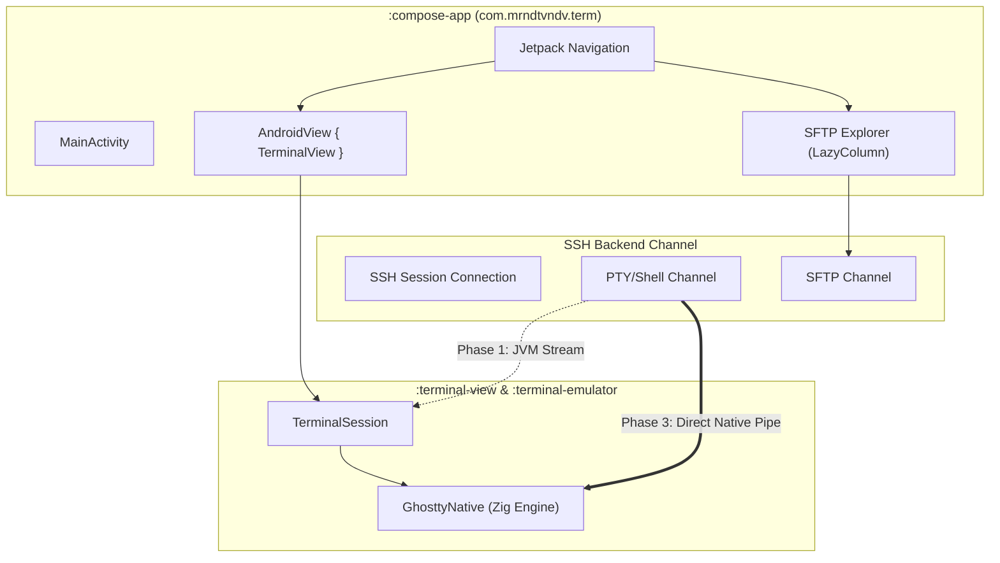

# Master Plan: Jetpack Compose SSH/SFTP Application Architecture

This is the master architecture document for building the new `:compose-app` application module (`com.mrndtvndv.term`). The app is designed strictly as a high-performance SSH client and SFTP file manager using an interoperable UI layout and a phased implementation roadmap.

## 1. Architectural Blueprint

We reuse `:terminal-view` and `:terminal-emulator` as gradle libraries. The UI is built 100% in Jetpack Compose, embedding [TerminalView](file:///Volumes/realme/Dev/termux-ghostty/terminal-view/src/main/java/com/termux/view/TerminalView.java) inside a focus-managed `AndroidView` interop container.

## 2. Decoupled Interface Layers
All SSH/SFTP network transactions are placed behind Kotlin interfaces:
* **[SshSession](file:///Volumes/realme/Dev/termux-ghostty/plans/compose-app/phase_1_jvm_prototype.md)**
* **[SshShellChannel](file:///Volumes/realme/Dev/termux-ghostty/plans/compose-app/phase_1_jvm_prototype.md)**
* **[SftpClient](file:///Volumes/realme/Dev/termux-ghostty/plans/compose-app/phase_1_jvm_prototype.md)**

This isolates the presentation layer from the specific underlying connection client.

## 3. Phased Implementation Roadmap
Detailed plans for each phase can be found here:
* **[Phase 1: JVM-Based Prototype](file:///Volumes/realme/Dev/termux-ghostty/plans/compose-app/phase_1_jvm_prototype.md):** Module bootstrap, dependency setup, interface contract creation, and initial prototype utilizing the SSHJ library.
* **[Phase 2: Compose UI & UX Design](file:///Volumes/realme/Dev/termux-ghostty/plans/compose-app/phase_2_compose_ui.md):** Scaffold layouts, workspaces navigation, reactive ViewModel SFTP list mappings, extra keys keyboard toolbars, and file action behaviors.
* **[Phase 3: Native Zig Piping Backend](file:///Volumes/realme/Dev/termux-ghostty/plans/compose-app/phase_3_native_piping.md):** Compiling libssh2 for Android, native JNI bindings, JNI buffer pipelines, direct memory streams in Zig, and swapping out Phase 1 implementations via DI.
* **[Future-Proofing: Remote Multiplexer](file:///Volumes/realme/Dev/termux-ghostty/plans/compose-app/future_multiplexer_integration.md):** Feasibility, architecture designs, and protocol formats to support remote terminal multiplexers (such as tmux, Mosh, or custom Zig protocols) seamlessly.
* **[Future-Proofing: tmux Switcher & Notifications](file:///Volumes/realme/Dev/termux-ghostty/plans/compose-app/native_tmux_and_osc_notifications.md):** Designing native switcher panels for tmux sessions and using terminal OSC sequences to trigger push notifications.
