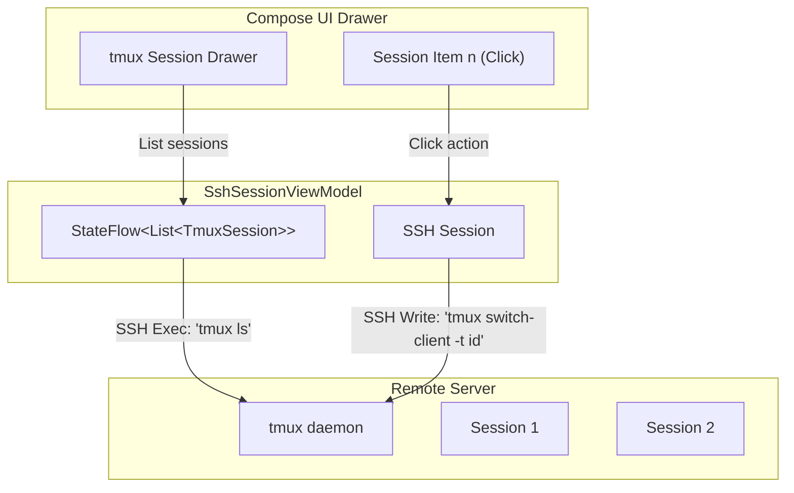

# Future-Proofing: Native tmux Session Switcher & Server Notifications

This document outlines the architecture for integrating native Android notification triggers (via terminal OSC escape codes) and building a native Jetpack Compose **tmux session switcher** inside the `:compose-app` client.

---

## 1. Server-to-Client Notification Protocol (OSC 777 & OSC 9)

Rather than running custom reverse ports or background network listeners on the server, we utilize standard **OSC (Operating System Command) Terminal Sequences**. When a script or background agent on the remote server finishes a task, it outputs a print sequence:

```bash
# Standard OSC 777 notification code
printf "\033]777;notify;Task Completed;The build finished successfully\007"
```

### The Plumbing Pipeline
1. **Parser Layer:** The native Zig `ghostty-vt` engine decodes the OSC sequence and raises the `.show_desktop_notification` event.
2. **JNI Layer:** The JNI export binds this event and makes a callback up to Java:
   ```zig
   // Zig JNI export callback trigger
   fn notifyJavaDesktopNotification(env: *JNIEnv, callback_obj: jobject, title: []const u8, body: []const u8) void {
       // Call JVM Session Client callback method
   }
   ```
3. **Android UI Notification:** The app catches the title and body, checking background rate-limiters. If the app is in the background, it creates a native Android system notification (`NotificationCompat.Builder`). If the app is in the foreground, it displays a slide-down Compose banner.

---

## 2. Native tmux Session Switcher in Compose

Instead of interacting with tmux’s native text-based session selection menu (`Prefix + s`), we can query the remote host's tmux daemon and build a beautiful, reactive Material 3 navigation drawer or bottom sheet in Jetpack Compose.



### A. Querying Remote tmux Sessions
We launch a background command channel over SSH to query tmux sessions programmatically:
```bash
tmux list-sessions -F '#{session_id}:#{session_name}:#{session_attached}'
```

The output is parsed into domain objects in our ViewModel:
```kotlin
data class TmuxSession(
    val id: String,
    val name: String,
    val isAttached: Boolean
)
```

---

### B. Designing the Compose Switcher UI
A side navigation drawer allows the user to view and click sessions dynamically:

```kotlin
@Composable
fun TmuxSessionDrawer(
    sessions: List<TmuxSession>,
    activeSessionId: String,
    onSessionSelected: (TmuxSession) -> Unit,
    content: @Composable () -> Unit
) {
    ModalNavigationDrawer(
        drawerContent = {
            ModalDrawerSheet {
                Text("Remote tmux Sessions", style = MaterialTheme.typography.titleMedium, modifier = Modifier.padding(16.dp))
                HorizontalDivider()
                LazyColumn {
                    items(sessions) { session ->
                        NavigationDrawerItem(
                            label = { Text(session.name) },
                            selected = session.id == activeSessionId,
                            onClick = { onSessionSelected(session) },
                            icon = {
                                Icon(
                                    imageVector = if (session.isAttached) Icons.Default.Link else Icons.Default.Dns,
                                    contentDescription = null
                                )
                            },
                            modifier = Modifier.padding(horizontal = 12.dp, vertical = 4.dp)
                        )
                    }
                }
            }
        },
        content = content
    )
}
```

---

### C. Executing the Session Switch
When a session is clicked, the client sends a fast command over the SSH interactive shell channel:
```bash
# Attach or switch active terminal viewport
tmux switch-client -t <session_name>
```
The remote terminal viewport instantly refreshes its grid contents, and the native Ghostty engine parses the new layout cells and triggers a redraw of [TerminalView](file:///Volumes/realme/Dev/termux-ghostty/terminal-view/src/main/java/com/termux/view/TerminalView.java).
