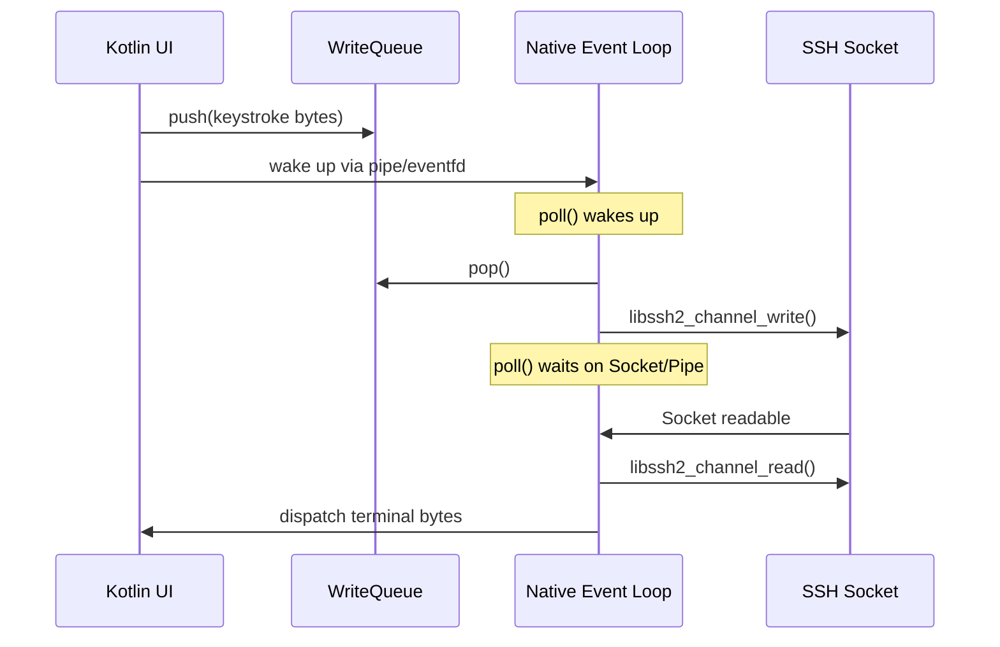

# Detailed Plan: Phase 3 — Native Zig Piping Backend

This document outlines the detailed action items for **Phase 3**, focusing on Android NDK cross-compilation of `libssh2` (with MbedTLS), JNI thread and reference safety, native synchronization to prevent race conditions in event loops, and implementing the high-performance direct-piping buffer network path.

---

## 1. Native Build Configuration & NDK Cross-Compilation

To compile `libssh2` for Android ABIs, we must build it along with a cryptographic backend. Using **MbedTLS** as the cryptographic backend is highly recommended over OpenSSL for its small footprint, clean C source base, and ease of cross-compilation with Zig or CMake.

### 1.1 Compilation Strategy: Static Linkage
1. **Compile Dependencies Statically:** Cross-compile `mbedtls` (including `libmbedcrypto`, `libmbedx509`, and `libmbedtls`) and `libssh2` as static libraries (`.a`).
2. **Bundle into a Single Shared Library:** Link these static libraries directly into the final `libghostty_ssh.so` (or `libghostty.so`) shared library. This ensures:
   - No runtime dynamic loading ordering issues (e.g., `dlopen` failures for transitive dependencies).
   - Minimal APK size overhead.
   - Clean scoping of symbols (hiding internal crypto/ssh symbols from other applications).

### 1.2 Target ABIs
Cross-compile for the four target Android ABIs:
* `arm64-v8a` (Zig target: `aarch64-linux-android`)
* `armeabi-v7a` (Zig target: `arm-linux-androideabi`)
* `x86_64` (Zig target: `x86_64-linux-android`)
* `x86` (Zig target: `i386-linux-android`)

### 1.3 Example Zig Build Configuration (`build.zig` integration)
Below is a conceptual pattern to integrate `libssh2` and `mbedtls` into your `build.zig` workspace:
```zig
const std = @import("std");

pub fn build(b: *std.Build) void {
    const target = b.standardTargetOptions(.{});
    const optimize = b.standardOptimizeOption(.{});

    // Create the final JNI shared library
    const lib = b.addSharedLibrary(.{
        .name = "ghostty_ssh",
        .root_source_file = b.path("src/jni_bridge.zig"),
        .target = target,
        .optimize = optimize,
    });

    // Link JNI and Android logs
    lib.linkSystemLibrary("log");
    lib.linkLibC();

    // Compile & Link MbedTLS statically
    const mbedtls = b.dependency("mbedtls", .{
        .target = target,
        .optimize = optimize,
    });
    lib.linkLibrary(mbedtls.artifact("mbedcrypto"));
    lib.linkLibrary(mbedtls.artifact("mbedx509"));
    lib.linkLibrary(mbedtls.artifact("mbedtls"));

    // Compile & Link libssh2 statically
    const libssh2 = b.dependency("libssh2", .{
        .target = target,
        .optimize = optimize,
    });
    lib.linkLibrary(libssh2.artifact("ssh2"));

    b.installArtifact(lib);
}
```

---

## 2. JNI Threading and Memory Management

Integrating native background loops with JVM-managed lifecycles requires strict attention to JNI's thread and memory management rules. Failure to do so leads to garbage collection crashes, local reference table overflows, and memory leaks.

### 2.1 JNIEnv and Thread Attachment
* **No Shared `JNIEnv` across threads:** The `JNIEnv` pointer is thread-local and must never be stored or shared between native threads.
* **Background Thread Lifecycle:**
  - Any background thread spawned in Zig/C (e.g., terminal event loops) that needs to invoke JNI callbacks must first be attached to the Java VM.
  - Use `AttachCurrentThreadAsDaemon` instead of `AttachCurrentThread`. This guarantees that the background thread is treated as a daemon, allowing the JVM to shut down without waiting for the native thread.
  - **Crucial:** You must call `DetachCurrentThread` when the native thread exits. Failing to do so causes resource leaks and eventual VM crashes.

```zig
// Zig example of attaching/detaching a thread
fn threadRunLoop(vm: *c.JavaVM, callback_obj: c.jobject) void {
    var env: ?*c.JNIEnv = null;
    const attach_res = (*vm).AttachCurrentThreadAsDaemon(vm, @ptrCast(&env), null);
    if (attach_res != c.JNI_OK) {
        std.log.err("Failed to attach thread to JVM", .{});
        return;
    }
    defer _ = (*vm).DetachCurrentThread(vm);

    // Run event loop...
}
```

### 2.2 Reference Management
* **Global References for Callback Objects:**
  - Kotlin UI listeners or callback instances passed into Zig via JNI are local references. They are destroyed as soon as the JNI boundary function returns.
  - To invoke callbacks from a native background thread or save them across JNI calls, you must promote them to global references:
    ```zig
    const global_cb = (*env).NewGlobalRef(env, local_cb);
    ```
  - When the native session terminates, you must explicitly free the global reference to prevent memory leaks:
    ```zig
    (*env).DeleteGlobalRef(env, global_cb);
    ```
* **Local Reference Table Limit (Local Ref Exhaustion):**
  - JNI maintains a thread-local table of local references (typically capped at 512 entries).
  - In a continuous read loop, allocating local objects (e.g., `jbyteArray` or string variables to pass chunks of data) without explicit cleanup will quickly overflow this table.
  - **Resolution:** Explicitly call `DeleteLocalRef` for all local variables created inside loops, or scope the loop body using `PushLocalFrame` / `PopLocalFrame`.

```zig
// Correct buffer emission loop
while (session_active) {
    const bytes_read = read_from_ssh(buf);
    if (bytes_read > 0) {
        // Creates a local reference to a jbyteArray
        const j_arr = (*env).NewByteArray(env, bytes_read);
        (*env).SetByteArrayRegion(env, j_arr, 0, bytes_read, buf);
        
        // Pass to Kotlin callback
        (*env).CallVoidMethod(env, global_callback, on_data_method, j_arr);
        
        // CRITICAL: Delete local ref inside loop to prevent local reference table overflow!
        (*env).DeleteLocalRef(env, j_arr);
    }
}
```

### 2.3 GC Safety and Native Pointers
* **Session Lifecycle Handle:** Store the address of the `SshNativeSession` struct in a Kotlin `Long` variable (e.g., `private var nativeSessionPtr: Long = 0L`).
* **Safe Pointer Casting:**
  ```kotlin
  // Kotlin bridge helper
  external fun nativeConnect(socket: Int): Long
  external fun nativeDisconnect(ptr: Long)
  ```
  On the native side, safely cast the `jlong` to the struct pointer, ensuring standard null/validation checks before dereferencing:
  ```zig
  const self = @as(*SshNativeSession, @ptrFromInt(ptr));
  ```

---

## 3. Native Concurrency and Event Loop (Race Condition Prevention)

`libssh2` is **not thread-safe**. Attempting to perform concurrent read operations (on a background reader thread) and write operations (triggered by user key events on the main JVM thread) on the same `LIBSSH2_SESSION` or `LIBSSH2_CHANNEL` will lead to fatal state corruption.

### 3.1 Synchronization Options

There are two primary patterns to address this constraint:

#### Option A: Thread-Safe Session Mutex (Simpler, Blocking I/O)
Maintain a native mutex (`std.Thread.Mutex` in Zig) inside the `SshNativeSession` wrapper. Every interaction with the session/channel must acquire this lock.
* **Pros:** Simpler to implement.
* **Cons:** If `libssh2_channel_read` blocks waiting for remote data, it holds the lock. The Kotlin thread trying to write keystroke input via `libssh2_channel_write` will block until a packet arrives, causing severe input lag.
* **Mitigation:** Use short read timeouts, or put the socket in non-blocking mode with select/poll to ensure the lock is never held indefinitely.

#### Option B: Single-Threaded Event Loop (Recommended, Non-blocking I/O)
Configure the `libssh2` session to run in non-blocking mode:
```zig
_ = c.libssh2_session_set_blocking(self.session, 0);
```
Run a single native event thread that owns the socket file descriptor and processes both reading and writing:
1. **Read Path:** The event loop uses `poll` or `epoll` to sleep until the socket is readable. It then calls `libssh2_channel_read`.
2. **Write Path:** Maintain a thread-safe lock-free (or mutex-protected) queue of pending write buffers.
3. **Event Notification:** Create a pipe (`pipe()`) or an `eventfd` descriptor. Include the read end of the pipe in the `poll` descriptor array.
4. **Triggering Writes:** When Kotlin calls `nativeWrite`, the data is pushed onto the write queue, and a byte is written to the pipe to wake up the `poll` loop.
5. **Execution:** The loop wakes up, processes the write queue, calls `libssh2_channel_write`, and returns to poll.

This design completely isolates the non-thread-safe `libssh2` operations to a single worker thread, eliminating race conditions and minimizing latency.



---

## 4. Direct Native Piping (Zero JVM Crossing)

To feed the terminal screen buffer with decrypted SSH terminal packets without JVM overhead:

1. **Direct Terminal Connection:**
   * Do not pass SSH output stream bytes up to Kotlin/Java just to feed them back into the native terminal engine.
   * Instead, write a direct internal piping interface in Zig connecting the `libssh2` session reader loop straight to the **Ghostty/Termux PTY/Parser input interface**.
2. **Write Path (Key typing):**
   * Keystrokes are captured by the Compose terminal UI, passed through standard input wrappers, and written directly using `libssh2_channel_write` (or pushed to the event loop's write queue).

---

## 5. Dependency Injection Configuration

Provide the swap configuration in the app’s dependency injection module to seamlessly toggle between the JVM prototype and the native backend:

```kotlin
@Module
@InstallIn(SingletonComponent::class)
abstract class SshModule {

    @Binds
    @Singleton
    abstract fun bindSshSession(
        // Swap implementation:
        // JvmSshSession -> NativeSshSession (Phase 3 swap)
        impl: NativeSshSession
    ): SshSession
}
```

---

## 6. Phase 3 Verification Checklist
* [ ] `libssh2` compiles successfully for all four target Android ABIs with `mbedtls` statically linked.
* [ ] Memory leaks verified to be absent after multiple connect/disconnect cycles (no JNI Global Reference leaks).
* [ ] Thread attachment is fully decoupled; daemon status confirmed; no VM crashes on terminal close.
* [ ] Run high-volume terminal output commands (e.g. `yes`, `find /`) and verify no local reference overflows (JNI Local Reference Table limit).
* [ ] Run concurrent read/write test cases to verify no `libssh2` state corruption or deadlock conditions.
* [ ] Typing characters behaves correctly over the native pipe with zero input latency.

---
*Related Documents:*
* [Master Plan](file:///Volumes/realme/Dev/termux-ghostty/plans/compose-app/master_plan.md)
* [Phase 1: JVM-Based Prototype](file:///Volumes/realme/Dev/termux-ghostty/plans/compose-app/phase_1_jvm_prototype.md)
* [Phase 2: Compose UI & UX Design](file:///Volumes/realme/Dev/termux-ghostty/plans/compose-app/phase_2_compose_ui.md)
