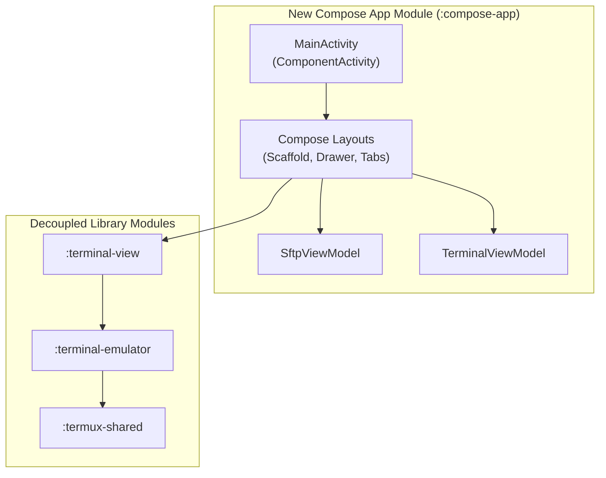

# Plan: Custom Compose-Native Terminal App Architecture

This plan details the design and implementation steps for building a new, 100% Jetpack Compose-native Android application that reuses the high-performance native Ghostty terminal emulator and renderer modules.

---

## 1. Architectural Strategy

Instead of incrementally refactoring the legacy, XML-heavy `:app` module, we can introduce a new application module (e.g., `:compose-app`) or completely swap out the `:app` module. The core components of the terminal are already decoupled into reusable Gradle libraries:

* **`:terminal-emulator`:** Contains the JNI bindings to `libtermux-ghostty.so`, session management, standard I/O streams, and native command execution.
* **`:terminal-view`:** Custom Java view ([TerminalView.java](file:///Volumes/realme/Dev/termux-ghostty/terminal-view/src/main/java/com/termux/view/TerminalView.java)) responsible for grid layout, gestures, text selection, and drawing performance.
* **`:termux-shared`:** Utility methods, system properties, environment management, and path resolution helpers.



---

## 2. Key Challenges & Solutions

### A. Bootstrap & Filesystem Prefixes (Crucial for Local Shells)
* **The Problem:** The local Linux environment in Termux depends on absolute paths targeting its application package ID (normally `com.termux`). If your new app has a package ID like `com.ghostty.terminal`, all binaries compiled for `/data/data/com.termux/files/usr` will fail due to hardcoded dynamic linker paths (shebangs, libraries).
* **The Solution:**
  1. **Option A (Shared Package ID):** Build the new application under the same package ID (`com.termux`), swapping out the `:app` module or replacing the old launcher activity in `AndroidManifest.xml` with your Compose activity.
  2. **Option B (SSH/Remote Focus):** If your app is strictly an **SSH client & SFTP manager**, you do not need a local bootstrap environment at all! You run commands directly on remote hosts over SSH channels. This eliminates filesystem prefix dependency, reducing APK size dramatically (no bootstrap downloads or native environment extraction needed).

### B. Keyboard & Gesture Handling
* **The Problem:** [TerminalView](file:///Volumes/realme/Dev/termux-ghostty/terminal-view/src/main/java/com/termux/view/TerminalView.java) intercepts keycodes, gestures, and IME (Input Method Editor) events. When embedded in Compose's layout hierarchy, Compose's own focus/key management can block these events.
* **The Solution:** Use Compose's `FocusRequester` and set the `AndroidView` to be focusable:
  ```kotlin
  val focusRequester = remember { FocusRequester() }
  AndroidView(
      factory = { context ->
          TerminalView(context, null).apply {
              isFocusable = true
              isFocusableInTouchMode = true
          }
      },
      modifier = Modifier
          .focusRequester(focusRequester)
          .focusable()
          .clickable { focusRequester.requestFocus() }
  )
  ```

---

## 3. Comparison of Approaches

| Metric / Dimension | Option 1: Incremental XML-to-Compose | Option 2: Brand New Compose App |
| :--- | :--- | :--- |
| **Effort** | Moderate. Refactor existing activities. | Higher setup, but cleaner code logic. |
| **Legacy Code Weight** | High. Must carry around old activity lifecycle helper classes. | Zero. Fresh architecture (MVVM, StateFlow, Coroutines). |
| **Package ID Complexity** | Low. Stays `com.termux`, local bootstrap works out of the box. | Higher if targeting local shell; trivial if targeting SSH/remote. |
| **UI Flexibility** | Constrained by existing activity structures. | Infinite. Modern split-pane, sliding drawers, and tabs. |

---

## 4. Implementation Steps for a New Compose App

### Step 1: Create the Module
Add a new phone/tablet project template module `:compose-app` inside the codebase. Declare project dependencies in `:compose-app/build.gradle`:
```groovy
dependencies {
    implementation project(':terminal-view')
    implementation project(':terminal-emulator')
    implementation project(':termux-shared')
    
    // Compose & Material 3
    implementation platform('androidx.compose:compose-bom:2024.06.00')
    implementation 'androidx.compose.ui:ui'
    implementation 'androidx.compose.material3:material3'
    implementation 'androidx.activity:activity-compose:1.9.0'
}
```

### Step 2: Swap Launcher Activity
In the new module's `AndroidManifest.xml`, declare the main Compose activity as the primary entry point:
```xml
<activity
    android:name=".MainActivity"
    android:exported="true"
    android:theme="@style/Theme.ComposeTerminal">
    <intent-filter>
        <action android:name="android.intent.action.MAIN" />
        <category android:name="android.intent.category.LAUNCHER" />
    </intent-filter>
</activity>
```

### Step 3: Implement standard MVVM for SSH & Terminal Sessions
Compose UI components should listen to a state flow emitted by a `TerminalViewModel` that keeps track of active SSH and local terminal sessions:
```kotlin
class TerminalViewModel : ViewModel() {
    private val _sessions = MutableStateFlow<List<TerminalSession>>(emptyList())
    val sessions = _sessions.asStateFlow()

    fun createSshSession(config: SshConfig) {
        viewModelScope.launch(Dispatchers.IO) {
            // Establish connection, spin up terminal session
            val newSession = SshConnectionManager.connect(config)
            _sessions.update { it + newSession }
        }
    }
}
```
